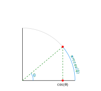

Chebyshev polynomials are a sequence of orthogonal polynomials that play a central role in numerical analysis, approximation theory, and applied mathematics. They are named after the Russian mathematician Pafnuty Chebyshev and come in two primary types: Chebyshev polynomials of the first kind ($T_n(x)$) and Chebyshev polynomials of the second kind ($U_n(x)$).

# Chebyshev Polynomials of the First Kind

There are many different ways to define the Chebyshev polynomials of the first kind. The one that seems most logical to me and most useful in terms of outlining various properties of the polynomials is

$$\label{eq:1}
T_{n}(x) = \cos{\left(n \arccos{x}\right)}, \quad x \in [-1, 1].\tag{1}
$$

Looking at \eqref{eq:1} it is not obvious why $T_{n}(x)$ would be a polynomial. In order to show it is indeed a polynomial let's recall the de Moivre's formula

$$
\cos{(n \theta)} + i\sin{(n \theta)} = (\cos(\theta) + i \sin{\theta})^n.
$$

We can apply binomial expansion and take the real part from it to obatin

$$\label{eq:2}
\cos(n \theta) = \sum_{k = 0}^{\frac{n}{2}} C(n, 2k) (-1)^k \cos^{n - 2k}\theta \sin^{2k}{\theta}. \tag{2}
$$

where 

$$
C(n, 2k) = \frac{n!}{(2k)!(n-2k)!}, \quad n \geq 2k, k \in N, n \in N
$$ 

denotes the binomal coefficient. We can also notice that

$$
\sin^{2k}\theta = (\sin^2{\theta})^k = (1 - \cos^2{\theta})^k,
$$

showing that \eqref{eq:2} is a polynomial of $\cos{\theta}$ of degree $n$. Now, let

$$
\theta = \arccos{x},
$$

and by utilising $\cos{\left(\arccos{x}\right)} = x$ we get

$$
x = \cos{\theta}.
$$

This transforms \eqref{eq:1} to 

$$\label{eq:3}
T_{n}(\cos{\theta}) = \cos{\left(n \theta\right)} \tag{3}
$$

which we already showed is a polynomial of degree $n$. From here, because $\cos(.)$ is an even function, we can note that

$$
T_{n}(x) = T_{-n}(x) = T_{|n|}(x.)
$$

From \eqref{eq:3} it is also obvious that the values of $T_n$ in the interval $[-1, 1]$ are bounded in $[-1, 1]$ because of the cosine.

## Chebyshev Nodes of the First Kind

Before we continue with exploring the roots of the polynomials, let's recall some trigonometry. 

---

The **unit circle** is a circle with a radius of 1, centered at the origin of the Cartesian coordinate system. Below is shown part of the unit circle corresponding to the region from $0$ to $\frac{\pi}{2}$.

The cosine of an angle $\theta$ corresponds to the $x$-coordinate of the point where the terminal side of the angle (measured counterclockwise from the positive $x$-axis) intersects the unit circle. In other words, $\cos(\theta)$ gives the horizontal distance from the origin to this intersection point. 

The **arccosine** is the inverse function of cosine, and it maps a cosine value back to its corresponding angle in the range $[0, \pi]$ radians. For a given $x$-coordinate on the unit circle, the arccosine gives the angle $\theta$ such that $\cos(\theta) = x$, meaning

$$
\arccos(x) = \theta, \quad \text{where } \theta \in [0, \pi].
$$

Moreover, a **radian** is defined as the angle subtended at the center of a circle by an arc whose length is equal to the radius of the circle. For any circle, the length of an arc $s$ is given by

$$
s = r \cdot \theta,
$$

where $r$ is the radius of the circle, $\theta$ is the angle subtended by the arc at the center. This means that on the unit circle the length of the arc equals the measure of the angle in radians because $r = 1$, and hence

$$
s = \theta.
$$

---

Now, let's find the roots of the polynomial $T_{n}(x)$. If we take the definition in \eqref{eq:1} we have to solve

$$
\cos{\left(n \arccos{x}\right)} = 0, k \in N.
$$

The solutions in the interval $(-1, 1)$ are given by

$$
x_k = \cos{\left(\frac{2k - 1}{2n}\pi\right)}, n \in N, k = 1, 2, ...n.
$$

These roots are known as the **Chebyshev nodes of the first kind**, or the **Chebyshev zeros**. If we are working with an arbitrary interval $(a, b)$ the affine transformation 

$$
x_k = \frac{a + b}{2} + \frac{b - a}{2}\cos{\left(\frac{2k - 1}{2n}\pi\right)}, n \in N, k = 1, 2, ...n
$$

is needed. From the cosine properties we can also note that the nodes are symmetric with respect to the midpoint of the interval, and that the extrema of $T_n(x)$ over the interval $[-1, 1]$ alternate between $-1$ and $1$. Also, a very useful fact is that these nodes are used in polynomial interpolation to minimize the **Runge phenomenon**.

In the figure below we have shown the roots of $T_{8}(x)$ in blue. We have also built the perpendiculars from the roots to their interesction with the upper half of the unit circle, and marked these points in red.

{ width=50% }

Looking at the figure we can notice that the arc lengths between the red points seem to be of the same length. Let's show that this is indeed the truth.

We showed the roots are the cosine functions $\cos{\left(\frac{2k - 1}{2n}\pi\right)}, n \in N, k = 1, 2, ...n$. Thus, in the unit circle we have that the length of the corresponding arcs are equal to $\left( \frac{2k - 1}{2n}\pi \right), n \in N, k = 1, 2, ...n$. Let's take two red points which are direct neighbours, or in other words let's take two red points corresponding to the randomly chosen $m$ and $m + 1$ roots, $m \in k = \{1, 2, ..., n\}$. If we subtract them we are going to determine the length of the arc between them. We have

$$
\frac{2(m + 1) - 1}{2n}\pi - \frac{2m - 1}{2n}\pi = \frac{\pi}{n},
$$

meaning that between every two nodes the arc length is equal and has a value of $\frac{\pi}{n}$. A polynomial of degree $n$ has $n$ roots, which in our case are in the open interval $(-1, 1)$, meaning the arcs corresponding to every two neighbouring roots are $n - 1$, and the two arcs between the $x$-axis and the first and last roots due to the symmetry of roots have lenghts of

$$
\frac{1}{2}\left(\pi - \frac{n-1}{n}\pi\right) = \frac{\pi}{2n}.
$$

## Recurrence relation

This is probably a bit out of nowhere, but let's take a look at the following trigonometric identity

$$\label{eq:4}
\cos{\left((n + 1)\theta\right)} + \cos{\left((n - 1)\theta\right)} = 2 \cos{(\theta)} \cos{(n\theta)},\tag{4}
$$

and show that the left side indeed is equal to the right one. We are going to need the following two fundamental formulas of angle addition in trigonometry

$$
\cos{(\alpha + \beta)} = \cos{\alpha} \cos{\beta} - \sin{\alpha} \sin{\beta},
$$

and

$$
\cos{(\alpha - \beta)} = \cos{\alpha} \cos{\beta} + \sin{\alpha} \sin{\beta}.
$$

In our case we have

$$
\cos{\left((n + 1)\theta\right)} = \cos{\left(n\theta + \theta\right)} = \cos{(n\theta)} \cos{\theta} - \sin{(n\theta)} \sin{\theta},
$$

and

$$
\cos{\left((n - 1)\theta\right)} = \cos{\left(n\theta - \theta\right)} = \cos{(n\theta)} \cos{\theta} + \sin{(n\theta)} \sin{\theta}.
$$

Adding the above equations leads to the wanted result.

Now, we can see that the terms of \eqref{eq:4} are exactly in the form of the right side of \eqref{eq:1}, \eqref{eq:3}, hence we get

$$
T_{n + 1}(x) + T_{n - 1}(x) = 2T_{n}(x)T_{1}(x),
$$

or we get the useful **recurrence relation**

$$
T_{n + 1}(x) - 2xT_{n}(x) + T_{n - 1}(x) = 0.
$$

This relation along with adding $T_{0}(x) = 1$ and $T_{1}(x) = x$ is another famous way to define the Chebyshev polynomials of the first kind.

---

An interesting way to represent this relation is via the determinant

$$
T_{k}(x) = \det \begin{bmatrix}
x & 1 & 0 & \dots & 0 \\
1 & 2x & 1 & \ddots & \vdots \\
0 & 1 & 2x & \ddots & 0 \\
\vdots & \ddots & \ddots & \ddots & 1 \\
0 & \dots & 0 & 1 & 2x
\end{bmatrix}.
$$

Below is a visualisation of some of the polynomials up to degree $6$.

## Symmetry

If we return to the polynomials reprsented as functions of $x$ adn write the first $7$ polynomials 

we can notice that Chebyshev polynomials of even order have even symmetry and therefore contain only even powers of x, and ... odd order have odd symmetry and therefore contain only odd powers of x. Or, formally written

$$
T_{n}(-x) = (-1)^n T_{n}(x) = \left\{\begin{align*}
T_{n}(x), \quad \text{for} \quad n \quad \text{even}, \\
-T_{n}(x) \quad \text{for} \quad n \quad \text{odd}.
\end{align*}\right.
$$

# Chebyshev Polynomials of the Second Kind

# Chebyshev Nodes of the Second Kind

Code

...

Plots

{ width=45% }{ width=45% }

# Plots

Code

...

Plots:

{width=45%}{width=45%}

