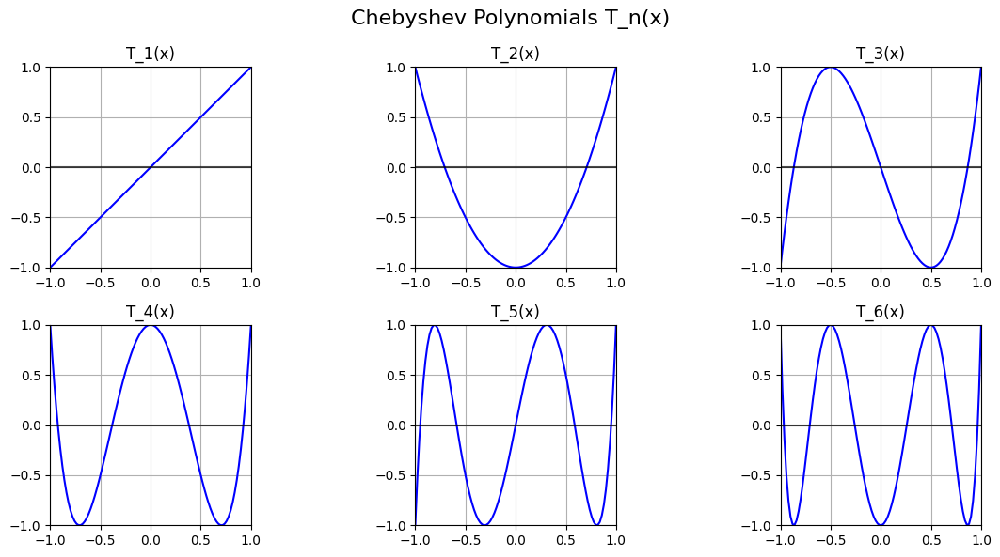
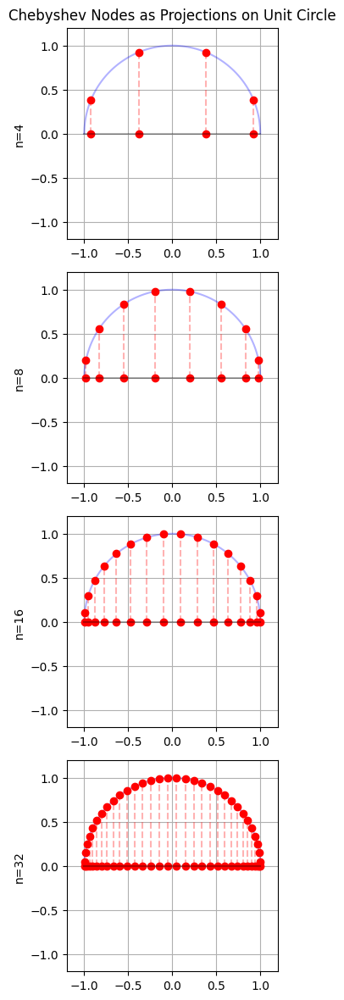
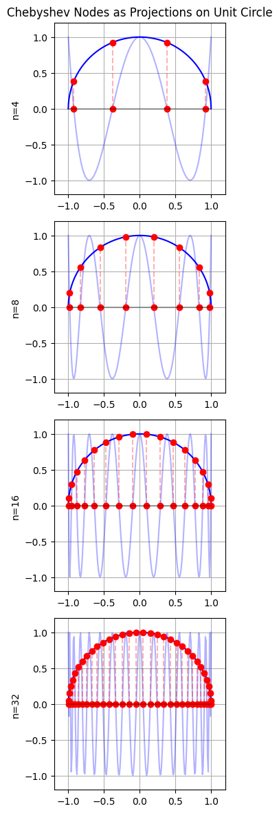
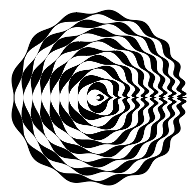
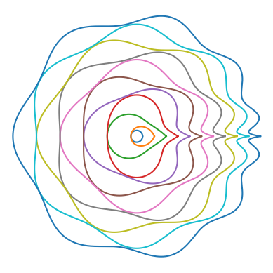

Chebyshev polynomials are a sequence of orthogonal polynomials that play a central role in numerical analysis, approximation theory, and applied mathematics. They are named after the Russian mathematician Pafnuty Chebyshev and come in two primary types: Chebyshev polynomials of the first kind ($T_n(x)$) and Chebyshev polynomials of the second kind ($U_n(x)$).

# Chebyshev Polynomials of the First Kind

There are many different ways to define the Chebyshev polynomials of the first kind. The one that seems most logical to me and most useful in terms of outlining various properties of the polynomials is

$$\label{eq:1}
T_{n}(x) = \cos{\left(n \arccos{x}\right)}.\tag{1}
$$

Looking at \eqref{eq:1} it is not obvious why $T_{n}(x)$ would be a polynomial. In order to show it is indeed a polynomial let's recall the de Moivre's formula

$$
\cos{(n \theta)} + i\sin{(n \theta)} = (\cos(\theta) + i \sin{\theta})^n.
$$

We can apply binomial expansion and take the real part from it to obatin

$$\label{eq:2}
\cos(n \theta) = \sum_{k = 0}^{\frac{n}{2}} C(n, 2k) (-1)^k \cos^{n - 2k}\theta \sin^{2k}{\theta}. \tag{2}
$$

where 

$$
C(n, 2k) = \frac{n!}{(2k)!(n-2k)!}, \quad n \geq 2k, k \in N, n \in N
$$ 

denotes the binomal coefficient. We can also notice that

$$
\sin^{2k}\theta = (\sin^2{\theta})^k = (1 - \cos^2{\theta})^k,
$$

showing that \eqref{eq:2} is a polynomial of $\cos{\theta}$ of degree $n$. Now, let

$$
\theta = \arccos{x},
$$

and by utilising $\cos{\left(\arccos{x}\right)} = x$ we get

$$
x = \cos{\theta}.
$$

This transforms \eqref{eq:1} to 

$$\label{eq:3}
T_{n}(\cos{\theta}) = \cos{\left(n \theta\right)} \tag{3}
$$

which we already showed is a polynomial of degree $n$.

This transforms \eqref{eq:1} to 

This transforms \eqref{eq:1} to 

---

An interesting way to represent this relation is via the determinant

$$
T_{k}(x) = \det \begin{bmatrix}
x & 1 & 0 & \dots & 0 \\
1 & 2x & 1 & \ddots & \vdots \\
0 & 1 & 2x & \ddots & 0 \\
\vdots & \ddots & \ddots & \ddots & 1 \\
0 & \dots & 0 & 1 & 2x
\end{bmatrix}.
$$

Below is a visualisation of some of the polynomials up to degree $6$.

## Symmetry

If we return to the polynomials reprsented as functions of $x$ adn write the first $7$ polynomials 

we can notice that Chebyshev polynomials of even order have even symmetry and therefore contain only even powers of x, and ... odd order have odd symmetry and therefore contain only odd powers of x. Or, formally written

$$
T_{n}(-x) = (-1)^n T_{n}(x) = \left\{\begin{align*}
T_{n}(x), \quad \text{for} \quad n \quad \text{even}, \\
-T_{n}(x) \quad \text{for} \quad n \quad \text{odd}.
\end{align*}\right.
$$

## Roots

# Chebyshev Polynomials of the Second Kind

# Chebyshev Nodes of the First Kind

Code

...

Plots

{ width=45% }{ width=45% }

# Plots

Code

...

Plots:

{width=45%}{width=45%}

