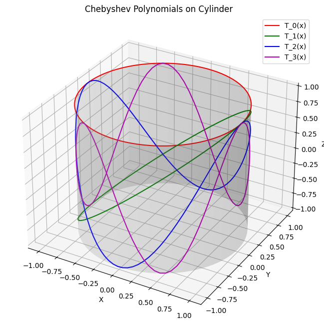

Chebyshev polynomials are a sequence of orthogonal polynomials that play a central role in numerical analysis, approximation theory, and applied mathematics. They are named after the Russian mathematician Pafnuty Chebyshev and come in two primary types: Chebyshev polynomials of the first kind ($T_n(x)$) and Chebyshev polynomials of the second kind ($U_n(x)$).

# Chebyshev Polynomials of the First Kind

One of the ways to define the Chebyshev polynomial of the first kind is

$$
T_{n}\left(\cos{\theta}\right) = \cos{(n \theta)}.
$$

From here, for $n = 0$ we have

$$
T_{0}(\cos{\theta}) = 1, \quad \text{hence} \quad T_{0}(x) = 1,
$$

for $n = 1$ we have

$$
T_{1}(\cos{\theta}) = \cos{\theta}, \quad \text{hence} \quad T_{1}(x) = x,
$$

for $n = 2$

$$
T_{2}(\cos{\theta}) = \cos(2\theta) = 2 \cos^2{\theta} - 1,
$$

or 

$$
T_{2}(x) = 2x^2 - 1 = 2xT_{1}(x) - T_{0}(x),
$$

and so on. The above expressions build the intutuion behind why one of the other ways to define these polynomials is with the recurrence relation

$$
T_{0}(x) = 1, \\
T_{1}(x) = x, \\
T_{n + 1}(x) = 2xT_{n}(x) - T_{n - 1}(x).
$$

An interesting way to represent this relation is via the determinant

$$
T_{k}(x) = \det \begin{bmatrix}
x & 1 & 0 & \dots & 0 \\
1 & 2x & 1 & \ddots & \vdots \\
0 & 1 & 2x & \ddots & 0 \\
\vdots & \ddots & \ddots & \ddots & 1 \\
0 & \dots & 0 & 1 & 2x
\end{bmatrix}.
$$

Below is a visualisation of some of the polynomials up to degree $6$.

Because they are periodic it is possible to plot them around a cylinder as shown below.

## Symmetry

If we return to the polynomials reprsented as functions of $x$ adn write the first $7$ polynomials 

we can notice that Chebyshev polynomials of even order have even symmetry and therefore contain only even powers of x, and ... odd order have odd symmetry and therefore contain only odd powers of x. Or, formally written

$$
T_{n}(-x) = (-1)^n T_{n}(x) = \left\{\begin{align*}
T_{n}(x), \quad \text{for} \quad n \quad \text{even}, \\
-T_{n}(x) \quad \text{for} \quad n \quad \text{odd}.
\end{align*}\right.
$$

## Roots

# Chebyshev Polynomials of the Second Kind

# Chebyshev Nodes of the First Kind

Code

...

Plots

{ width=45% }{ width=45% }

# Plots

Code

...

Plots:

{width=45%}{width=45%}

