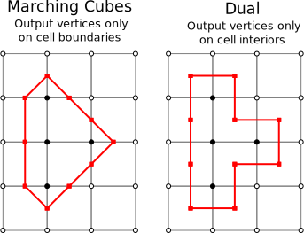
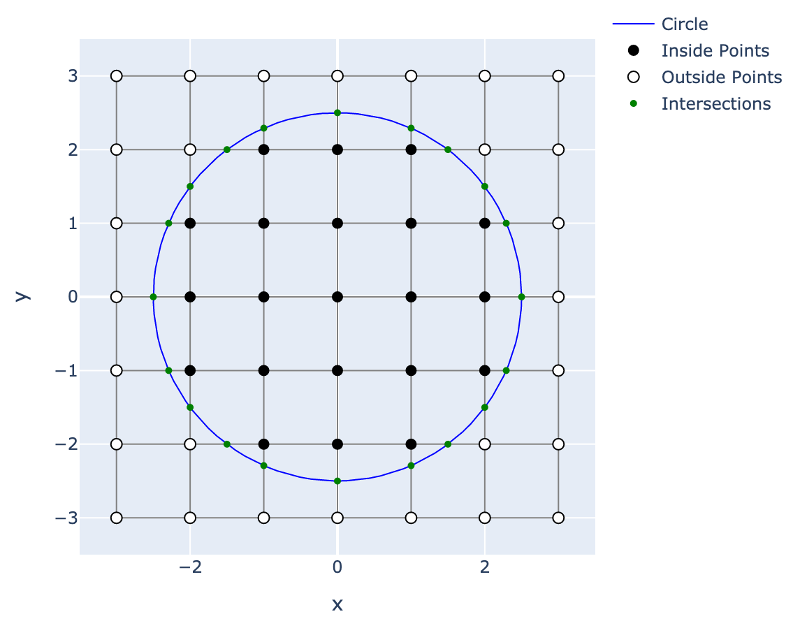
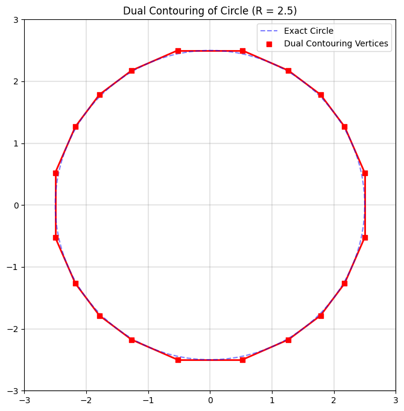
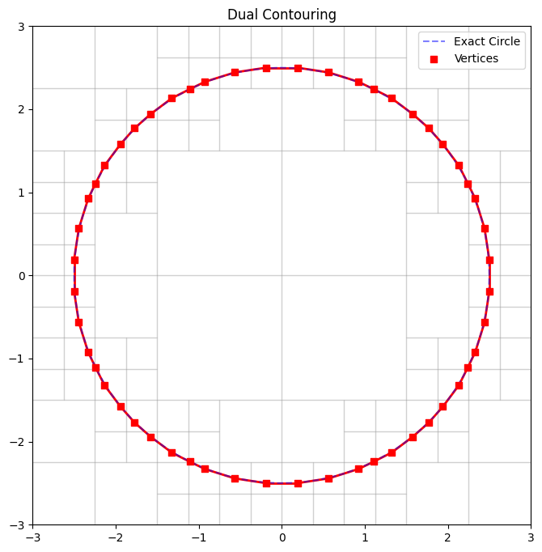

This post is going to cover the so called **Dual Contouring of Hermite Data** introduced in the following [paper](https://www.cs.rice.edu/~jwarren/papers/dualcontour.pdf). Dual Contouring is a surface extraction technique that builds on ideas from methods like Marching Cubes but uses “dual” grid information to place vertices in cells based on Hermite data (i.e. both the intersection points of the isosurface with grid edges and the corresponding normals). The algorithm is particularly good at capturing sharp features and generating crack‐free meshes. In what follows, we are goig to walk through the main ideas and steps in detail.

# Introduction

Traditional methods like **Marching Cubes** compute the intersection of an isosurface with the edges of a uniform grid and then connect these intersection points based on a lookup table. In contrast, on a very high-level, dual contouring

- collects **Hermite data** along cell edges which consists of both the point where the isosurface (approximately) intersects an edge and the unit surface normal (the gradient) at that point
- places a vertex per cell (the “dual” vertex) by optimally fitting these intersection constraints via minimization of a **quadratic error function** (QEF)
- constructs the mesh by connecting these vertices in the dual grid, ensuring that adjacent cells yield coherent connectivity

This approach not only results in a lower polygon count but is also more adept at preserving sharp features (edges and corners) inherent in the underlying surface. Below we can see a comparison between Marching Cubes and Dual Contouring in $R^2$. If we assume that the 

{ style="display: block; margin: 0 auto"}

# Hermite Data Extraction

## Generating the Data

Given a scalar field defined over a grid (for example, a signed distance function), you first:

- **Identify Intersections:** For each grid edge, detect a sign change in the scalar field. A sign change indicates that the isosurface (typically the zero level-set) crosses that edge.
- **Compute Intersection Points:** Use linear interpolation along the edge to compute the approximate point $\mathbf{p}_i$ where the scalar field equals zero.
- **Estimate Normals:** At each intersection, compute or sample the gradient (normal vector) $\mathbf{n}_i$ of the scalar field. This pair $(\mathbf{p}_i, \mathbf{n}_i)$ is called Hermite data.

Each cell in the grid that has one or more intersected edges becomes an “active cell” for which the dual vertex will be computed.

# Setting Up the Quadratic Error Function (QEF)

The core idea is to find, for each active cell, a point $\mathbf{x}$ that “best fits” all the local Hermite data. For each intersection constraint, the ideal condition is that $\mathbf{x}$ lies on the tangent plane defined by the intersection point and normal. That is, for a given intersection,

$$
\mathbf{n}_i \cdot (\mathbf{x} - \mathbf{p}_i) = 0.
$$

In practice, because there will be multiple intersecting edges (and because of noise or nonlinearity in the underlying surface), these constraints are not simultaneously satisfiable exactly. Instead, one minimizes the sum of squared distances of $\mathbf{x}$ from each tangent plane. This gives rise to the quadratic error function (QEF):

$$
Q(\mathbf{x}) = \sum_{i} \left( \mathbf{n}_i \cdot (\mathbf{x} - \mathbf{p}_i) \right)^2.
$$

## Expressing the QEF

Expanding the squared terms, we have:

$$
Q(\mathbf{x}) = \sum_{i} \left( \mathbf{n}_i^\top \mathbf{x} - \mathbf{n}_i^\top \mathbf{p}_i \right)^2.
$$

This is a quadratic function in $\mathbf{x}$ and can be written in the standard form:

$$
Q(\mathbf{x}) = \mathbf{x}^\top A \mathbf{x} - 2\,\mathbf{b}^\top \mathbf{x} + c,
$$

where the matrix $A$ and vector $\mathbf{b}$ are derived from the normals and intersection points:

- $A = \sum_i \mathbf{n}_i \mathbf{n}_i^\top$,
- $\mathbf{b} = \sum_i (\mathbf{n}_i \mathbf{n}_i^\top \mathbf{p}_i)$,
- $c = \sum_i (\mathbf{n}_i^\top \mathbf{p}_i)^2$ (which is constant with respect to $\mathbf{x}$).

Minimizing $Q(\mathbf{x})$ is a classic least-squares problem.

## Solving for the Optimal Vertex

To find the minimizer, take the derivative with respect to $\mathbf{x}$ and set it to zero:

$$
\frac{\partial Q}{\partial \mathbf{x}} = 2 A \mathbf{x} - 2 \mathbf{b} = 0 \quad \Longrightarrow \quad A \mathbf{x} = \mathbf{b}.
$$

In most cases, $A$ is a small (typically 3×3) symmetric matrix, and the system can be solved efficiently (using, for instance, a pseudo-inverse if $A$ is not full rank).

The resulting $\mathbf{x}$ is the optimal vertex for that cell—it minimizes the squared distances to all the tangent planes defined by the Hermite data.

# Dual Grid and Mesh Connectivity

## The Dual Grid Concept

Instead of placing vertices at grid intersections (as in Marching Cubes), dual contouring places one vertex per active cell. These vertices lie somewhere within the cell (or on its boundary) and represent the isosurface “inside” that cell.

## Connecting the Vertices

The connectivity (i.e., which vertices should be connected by edges) is determined by the topology of the original grid:

- **Dual Faces:** Each face of the dual mesh corresponds to an edge of the original grid that is shared by two active cells. If the isosurface passes through that grid edge, then the vertices computed in the two adjacent cells are connected by an edge.
- **Dual Cells:** Likewise, the polygons (faces) of the final mesh are built by connecting these dual vertices in a manner that respects the grid connectivity.

This strategy produces a polygonal mesh that is crack-free even when the underlying isosurface has sharp features.

# Handling Sharp Features and Ambiguities

One of the strengths of dual contouring is its ability to capture sharp edges and corners:

- **Sharp Features:** In regions where the surface has discontinuities in its derivative (e.g., along creases or corners), the Hermite data will reflect these sharp changes. The QEF minimization naturally tends to “balance” between the different tangent plane constraints, and—with appropriate additional constraints or weighting—it can preserve these features.

- **Vertex Clamping:** Sometimes the minimization might produce an optimal vertex $\mathbf{x}$ that lies outside the original cell, which can lead to topological artifacts (“cracks”) in the final mesh. In such cases, a **clamping procedure** is applied: the vertex is repositioned (often by projecting it back into the cell or finding a nearby point that still nearly minimizes the QEF) so that it lies within the cell.

These techniques help ensure that the final mesh accurately represents both smooth and sharp features of the underlying surface.

# Extensions: Adaptive Dual Contouring

The original dual contouring algorithm was designed for uniform grids, but the paper also discusses extensions to **adaptive octrees**:

- **Variable Cell Sizes:** By using an octree (or other adaptive data structure), cells can be subdivided where more detail is needed (for example, near sharp features or high curvature regions) and kept larger where the surface is smooth.

- **Crack-Free Transitions:** Special care is taken when connecting cells of different sizes. The algorithm defines strategies to “stitch” together the dual vertices from cells of varying resolutions so that the resulting mesh remains crack-free.

This adaptive version allows for efficient representations of complex surfaces with variable levels of detail.

# Summary of the Algorithm

To encapsulate, here is a step-by-step summary of the dual contouring algorithm as introduced in the paper:

**Data Generation:**

   - Evaluate the scalar field on a grid.
   - For each grid edge where a sign change occurs, compute the intersection point $\mathbf{p}_i$ and the normal $\mathbf{n}_i$ (the Hermite data).

**Cell Processing:**

   - Identify active cells (cells with one or more intersected edges).
   - For each active cell, collect all Hermite data from the intersected edges.

**QEF Setup and Minimization:**

   - Formulate the QEF: 
     $$
     Q(\mathbf{x}) = \sum_i \left( \mathbf{n}_i \cdot (\mathbf{x} - \mathbf{p}_i) \right)^2.
     $$
   - Solve the linear system $A \mathbf{x} = \mathbf{b}$ to obtain the optimal vertex $\mathbf{x}$.
   - Apply clamping if necessary to ensure $\mathbf{x}$ lies within the cell.

**Mesh Construction:**

   - Treat each active cell as a dual vertex location.
   - Connect dual vertices of adjacent cells to form the edges and faces of the isosurface.
   - Handle connectivity carefully (especially at cell boundaries) to avoid cracks.

**Adaptive Processing (if applicable):**

   - Use an adaptive grid (e.g., octree) to locally refine the mesh.
   - Ensure that transitions between different cell sizes are managed so that the final mesh is coherent and crack-free.

# Concluding Remarks

Dual contouring, as presented by Ju et al., offers a robust way to extract isosurfaces from volumetric data. By leveraging both intersection positions and normals (the Hermite data) and by formulating a QEF minimization problem for each cell, the method produces meshes that capture fine geometric details—including sharp features—while remaining topologically consistent. Its adaptability to varying resolutions further enhances its utility in applications ranging from computer graphics to scientific visualization.

# STH

Dual Contouring: 2D Circle Example

{ width=75% style="display: block; margin: 0 auto" }

{ width=50% }{ width=50% }

Dual Contouring 3D Sphere:

<iframe src="{static}/code/2025-01-20-dual-contouring/dc_3d.html" width="100%" height="600px" frameborder="10"></iframe>

## 1. Introduction

Dual contouring is an isosurface extraction technique that, in contrast to methods such as Marching Cubes, computes a vertex per cell (or “dual cell”) by fitting an implicit surface to Hermite data. Here, *Hermite data* refers to the pair $(\mathbf{p}_i, \mathbf{n}_i)$, where $\mathbf{p}_i \in \mathbb{R}^3$ is an approximate point of intersection between the isosurface (typically the zero level-set) and a grid edge, and $\mathbf{n}_i \in \mathbb{R}^3$ is the corresponding unit normal (often derived from the gradient of the underlying scalar field). By locally solving a constrained minimization problem based on these data, dual contouring yields a mesh that is capable of representing both smooth surfaces and sharp features.

## 2. Mathematical Formulation

### 2.1. Hermite Data Generation

Consider a scalar field $f: \mathbb{R}^3 \to \mathbb{R}$ defined over a regular grid. The isosurface is defined implicitly by the zero level-set:
$$
\mathcal{S} = \{ \mathbf{x} \in \mathbb{R}^3 \,:\, f(\mathbf{x}) = 0 \}.
$$
For each grid edge connecting two vertices $\mathbf{v}_a$ and $\mathbf{v}_b$, a sign change in $f$ (i.e., $f(\mathbf{v}_a) f(\mathbf{v}_b) < 0$) implies that an intersection exists along that edge. An approximate intersection point $\mathbf{p}_i$ is computed, commonly via linear interpolation:
$$
\mathbf{p}_i = \mathbf{v}_a + \frac{|f(\mathbf{v}_a)|}{|f(\mathbf{v}_a)|+|f(\mathbf{v}_b)|} \, (\mathbf{v}_b - \mathbf{v}_a).
$$
The surface normal $\mathbf{n}_i$ at $\mathbf{p}_i$ is typically estimated as
$$
\mathbf{n}_i = \frac{\nabla f(\mathbf{p}_i)}{\|\nabla f(\mathbf{p}_i)\|},
$$
thereby yielding the Hermite pair $(\mathbf{p}_i, \mathbf{n}_i)$.

### 2.2. Local Approximation via Tangent Planes

In an active cell (a cell with at least one intersected edge), assume we have a set of $m$ Hermite samples $\{(\mathbf{p}_i, \mathbf{n}_i)\}_{i=1}^m$. Under the assumption that the surface is locally well approximated by its tangent planes, each sample defines the local constraint
$$
\mathbf{n}_i \cdot (\mathbf{x} - \mathbf{p}_i) = 0, \quad i = 1,\dots, m,
$$
where $\mathbf{x} \in \mathbb{R}^3$ is a candidate vertex location. Since noise, discretization errors, or intrinsic surface curvature render the set of equations overdetermined, one seeks an $\mathbf{x}$ that minimizes the cumulative squared error.

## 3. Quadratic Error Function (QEF) Minimization

### 3.1. Formulation of the QEF

The quadratic error function (QEF) is defined as:
$$
Q(\mathbf{x}) = \sum_{i=1}^m \left( \mathbf{n}_i \cdot (\mathbf{x} - \mathbf{p}_i) \right)^2.
$$
This formulation can be rewritten in quadratic form. Defining the residual for each constraint as $r_i(\mathbf{x}) = \mathbf{n}_i^\top \mathbf{x} - \mathbf{n}_i^\top \mathbf{p}_i$, we have
$$
Q(\mathbf{x}) = \sum_{i=1}^m \left( r_i(\mathbf{x}) \right)^2.
$$
Expanding this sum, one obtains
$$
Q(\mathbf{x}) = \mathbf{x}^\top A \mathbf{x} - 2\, \mathbf{b}^\top \mathbf{x} + c,
$$
where
- The symmetric positive semi-definite matrix $A$ is given by
  $$
  A = \sum_{i=1}^m \mathbf{n}_i \mathbf{n}_i^\top,
  $$
- The vector $\mathbf{b}$ is defined as
  $$
  \mathbf{b} = \sum_{i=1}^m \left( \mathbf{n}_i \mathbf{n}_i^\top \mathbf{p}_i \right),
  $$
- And $c$ is a constant independent of $\mathbf{x}$:
  $$
  c = \sum_{i=1}^m \left( \mathbf{n}_i^\top \mathbf{p}_i \right)^2.
  $$

### 3.2. Optimality Conditions

To determine the optimal vertex position $\mathbf{x}^*$ that minimizes $Q(\mathbf{x})$, one sets the gradient of $Q$ with respect to $\mathbf{x}$ to zero:
$$
\nabla Q(\mathbf{x}) = 2 A \mathbf{x} - 2 \mathbf{b} = \mathbf{0}.
$$
Thus, the first-order optimality condition is
$$
A \mathbf{x}^* = \mathbf{b}.
$$
Since $A$ is a $3 \times 3$ matrix, standard linear algebra techniques (e.g., Cholesky decomposition, singular value decomposition (SVD) in the case of rank deficiency) are employed to solve for $\mathbf{x}^*$. This solution represents the point that minimizes the aggregate squared distance to the tangent planes defined by the Hermite data.

## 4. Dual Grid Construction and Mesh Connectivity

### 4.1. Dual Grid Concept

In dual contouring, each active cell (i.e., a cell that is intersected by the isosurface) is associated with a dual vertex located at $\mathbf{x}^*$. This dual vertex is typically not coincident with any of the original grid vertices, but rather is positioned optimally within (or near) the cell to best approximate the local surface geometry.

### 4.2. Connectivity Determination

The connectivity of the resulting mesh is derived from the combinatorial structure of the original grid. In particular:
- **Dual Faces:** Consider a grid edge that is shared by two adjacent cells. If the edge is intersected by the isosurface (as determined by a sign change in $f$), then the corresponding dual vertices from the two adjacent cells are connected by an edge in the output mesh.
- **Dual Cells:** The complete isosurface is obtained by “stitching” together the dual vertices through the dual faces. The underlying grid topology ensures that the resultant mesh is manifold and, with proper care, free of cracks.

This dual construction inherently differs from the direct (primal) isosurface extraction methods and is one of the reasons why dual contouring is adept at preserving sharp features.

## 5. Preservation of Sharp Features

A significant advantage of dual contouring is its capacity to capture sharp geometric features such as edges and corners. The presence of discontinuities in surface normals is naturally encoded in the Hermite data. The minimization of the QEF, when formulated with multiple intersecting tangent planes (which may not be co-planar), tends to produce a vertex $\mathbf{x}^*$ that is positioned near the intersection of the underlying planes. This behavior effectively preserves sharp features.  

To further reinforce the representation of sharp features, additional constraints or weighting strategies may be incorporated into the QEF formulation. For example, if a particular normal is deemed more reliable (or if it corresponds to a feature edge), its contribution in the sum may be amplified.

## 6. Handling Artifacts: Clamping and Cell Constraints

In some instances, the minimization of $Q(\mathbf{x})$ may yield a solution $\mathbf{x}^*$ that lies outside the spatial bounds of the cell. Such an outcome can lead to topological inconsistencies or "cracks" in the mesh. To mitigate this, the algorithm employs a **clamping procedure** where $\mathbf{x}^*$ is projected back into the cell or constrained to lie within its boundaries. This may be achieved via:
- **Projection Methods:** Compute the closest point within the cell to $\mathbf{x}^*$ that still approximately minimizes $Q$.
- **Penalty Methods:** Augment the QEF with penalty terms that heavily penalize positions outside the cell.

## 7. Adaptive Dual Contouring

The original method is defined on uniform grids, but an extension to adaptive grids (e.g., octrees) is provided. In an adaptive setting:
- **Variable Resolution:** Cells are subdivided adaptively in regions where the isosurface exhibits high curvature or where fine features are present.
- **Crack-Free Stitching:** Special algorithms are implemented to ensure that the interface between cells of different sizes is smooth and that no gaps (cracks) are introduced in the mesh.
- **Hierarchical Data Structures:** The use of octrees or similar data structures allows for efficient spatial queries and local refinement.

The adaptive dual contouring algorithm thus preserves both the efficiency and the high-quality representation of the surface.

## 8. Summary of the Algorithm

The dual contouring algorithm proceeds as follows:

1. **Data Generation:**
   - Evaluate the scalar field $f(\mathbf{x})$ at the grid vertices.
   - For each edge where $f$ changes sign, compute the intersection $\mathbf{p}_i$ via linear interpolation and estimate the corresponding normal $\mathbf{n}_i$.

2. **Active Cell Identification:**
   - Mark cells that contain one or more intersected edges.

3. **QEF Construction and Minimization (per active cell):**
   - Formulate the QEF:
     $$
     Q(\mathbf{x}) = \sum_{i=1}^m \left( \mathbf{n}_i \cdot (\mathbf{x} - \mathbf{p}_i) \right)^2.
     $$
   - Assemble the matrix $A$ and vector $\mathbf{b}$.
   - Solve the linear system $A \mathbf{x}^* = \mathbf{b}$ to obtain the optimal vertex position $\mathbf{x}^*$.
   - If $\mathbf{x}^*$ falls outside the cell, apply a clamping or correction procedure.

4. **Dual Mesh Generation:**
   - Assign each active cell a dual vertex at $\mathbf{x}^*$.
   - Establish mesh connectivity by linking dual vertices corresponding to adjacent cells that share an intersected grid edge.

5. **Adaptive Refinement (if applicable):**
   - Use an adaptive grid structure to refine regions of interest.
   - Implement strategies for stitching cells of different resolutions to maintain a crack-free surface.

## 9. Concluding Remarks

Dual contouring of Hermite data provides a robust framework for isosurface extraction that is both mathematically sound and computationally efficient. By minimizing a well-defined quadratic error function derived from local tangent plane constraints, the method ensures that the extracted vertex optimally represents the underlying geometry—even in the presence of sharp features. The dual grid paradigm further simplifies the connectivity determination and facilitates the extension to adaptive spatial discretizations.
