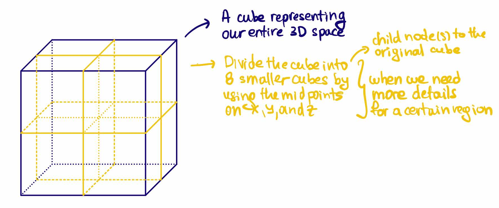
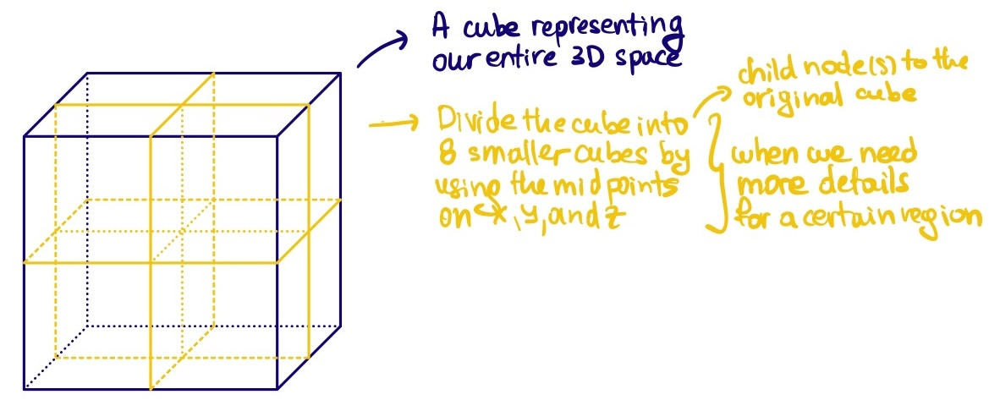
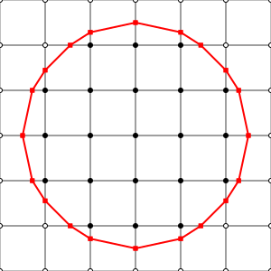
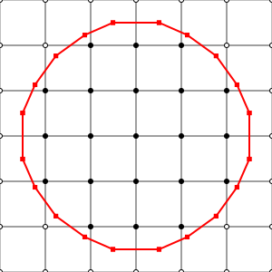

This post is going to cover the so called **dual contouring**.

# Octree

What is an octree?

{ width=60% style="display: block; margin: 0 auto"}

Octree:

{ width=50% style="display: block; margin: 0 auto"}

TBD

Marching Cubes vs Dual Contouring (2D Circle):

<!-- 

    
    

 -->

    

        
        
Marching Cubes

    

    

        
        
Dual Contouring

    

Marching Cubes vs Dual Contouring (3D Sphere):

<iframe src="{static}/code/2025-01-20-dual-contouring/comparison.html" width="100%" height="600px" frameborder="10"></iframe>

Dual Contouring: 2D Circle Example

{ width=75% style="display: block; margin: 0 auto" }
