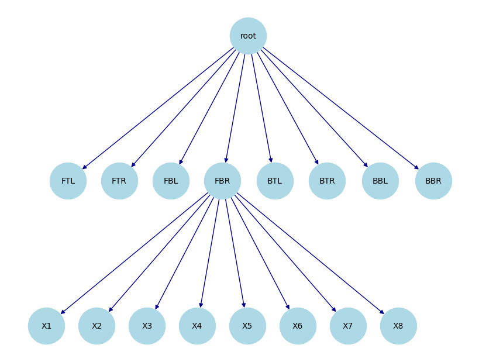

This post is going to cover the so called **Dual Contouring** introduced [here](https://www.cs.rice.edu/~jwarren/papers/dualcontour.pdf). Dual Contouring is a surface extraction technique that builds on ideas from methods like Marching Cubes but uses “dual” grid information to place vertices in cells based on Hermite data (i.e. both the intersection points of the isosurface with grid edges and the corresponding normals). The algorithm is particularly good at capturing sharp features and generating crack‐free meshes. In what follows, we are goig to walk through the main ideas and steps in detail.

# Introduction

Traditional methods like **Marching Cubes** compute the intersection of an isosurface with the edges of a uniform grid and then connect these intersection points based on a lookup table. In contrast, dual contouring:

- Collects **Hermite data** along cell edges—this data consists of both the point where the isosurface intersects an edge and the surface normal (the gradient) at that point.
- Places a vertex per cell (the “dual” vertex) by optimally fitting these intersection constraints via minimization of a **quadratic error function** (QEF).
- Constructs the mesh by connecting these vertices in the dual grid, ensuring that adjacent cells yield coherent connectivity.

This approach not only results in a lower polygon count but is also more adept at preserving sharp features (edges and corners) inherent in the underlying surface.

{ style="display: block; margin: 0 auto"}

# Octree

What is an octree?

{ width=60% style="display: block; margin: 0 auto"}

Octree:

{ width=50% style="display: block; margin: 0 auto"}

{ width=50% style="display: block; margin: 0 auto"}

TBD

Dual Contouring: 2D Circle Example

{ width=75% style="display: block; margin: 0 auto" }

{ width=50% }{ width=50% }

Dual Contouring 3D Sphere:

<iframe src="{static}/code/2025-01-20-dual-contouring/dc_3d.html" width="100%" height="600px" frameborder="10"></iframe>
