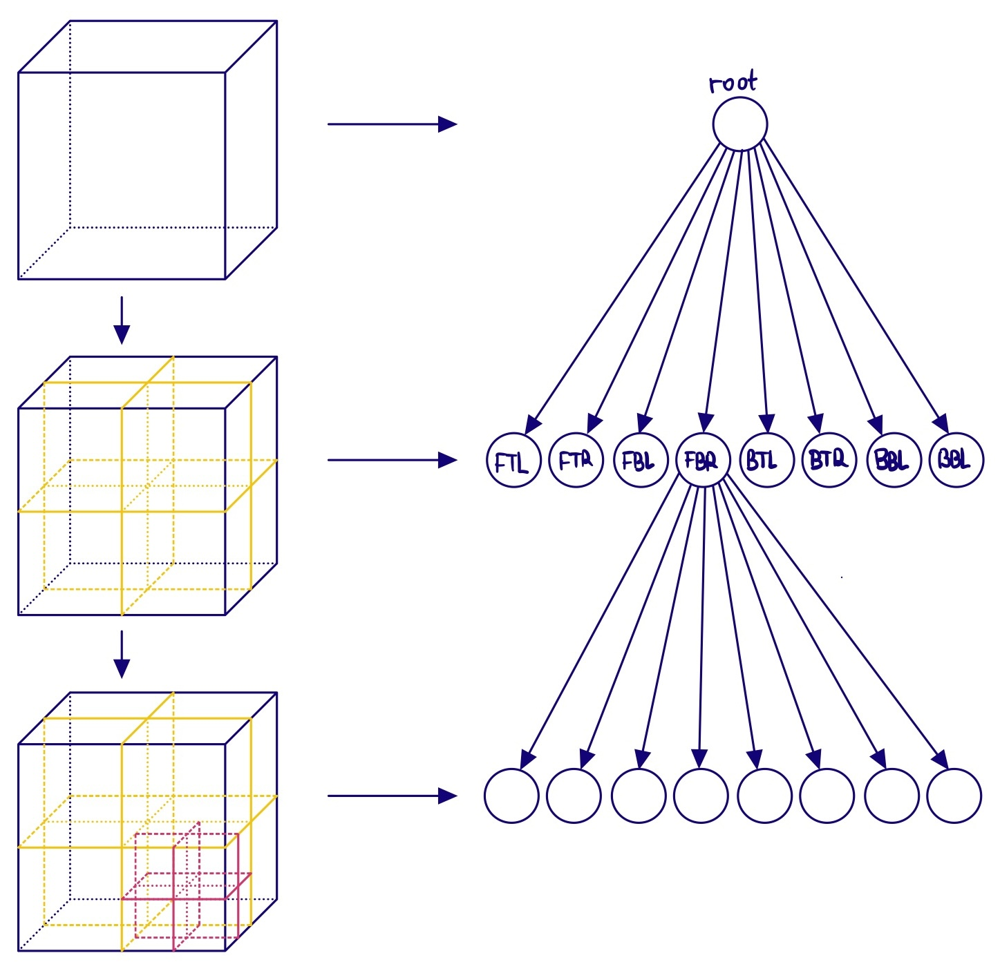

This post is going to cover the so called **dual contouring**.

# Octree

What is an octree?

{ width=60% style="display: block; margin: 0 auto"}

Octree:

{ width=50% style="display: block; margin: 0 auto"}

TBD

Dual Contouring: 2D Circle Example

{ width=75% style="display: block; margin: 0 auto" }

{ width=50% }{ width=50% }

Dual Contouring 3D Sphere:

<iframe src="{static}/code/2025-01-20-dual-contouring/dc_3d.html" width="100%" height="600px" frameborder="10"></iframe>
