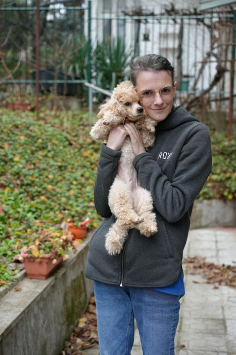
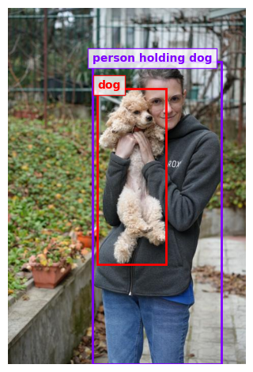

In this post, we are going to show a tutorial on using the Qwen2.5-VL model with MLX-VLM for visual understanding tasks. We are going to cover:

- Loading the model and image
- Generating a natural language description of an image
- Extracting spatial information (bounding boxes) for objects
- Visualizing the results

## Introduction

Qwen2.5-VL with MLX-LM is a state-of-the-art multimodal model that seamlessly integrates advanced vision and language processing capabilities. Designed to handle both images and videos, this model excels in generating detailed natural language descriptions and extracting spatial information from visual inputs. Leveraging cutting-edge transformer architectures, Qwen2.5-VL enables developers and researchers to build sophisticated applications in artificial intelligence, bridging the gap between visual perception and textual understanding.

## Loading Packages

We begin by importing the necessary libraries. The mlx_vlm package simplifies loading our Qwen2.5-VL model and handling image inputs. We also use libraries such as matplotlib for plotting and PIL for image processing.

```python
import json

import matplotlib.patches as patches
import matplotlib.pyplot as plt
import numpy as np
from mlx_vlm import apply_chat_template, generate, load
from mlx_vlm.utils import load_image
from PIL import Image
```

## Loading the Qwen2.5-VL Model and Processor

Next, we load the pre-trained Qwen2.5-VL model along with its processor using the provided model path. The processor helps in formatting the inputs (both text and image) in a way that the model can understand.

```python
model_path = "mlx-community/Qwen2.5-VL-3B-Instruct-bf16"
model, processor = load(model_path)
config = model.config
```

You’ll notice the loading process involves fetching several files. Once completed, the model is ready to process our inputs.

## Loading and Displaying the Image

For this tutorial, we use an image file (person_dog.jpg) which contains a person with a dog. We load the image using a helper function and then display its properties.

```python
image_path = "person_dog.jpg"
image = load_image(image_path)
print(image)  # Displays a PIL.Image.Image object

# Check image size
print(image.size)  # Example output: (467, 700)
```

At this point, if you’re using a Jupyter Notebook, simply typing image in a cell would render the image inline.



# Generating an Image Description

We now prepare a prompt to describe the image. The prompt is wrapped using the `apply_chat_template` function, which converts our query into the chat-based format expected by the model.

```python
prompt = "Describe the image."
formatted_prompt = apply_chat_template(
    processor, config, prompt, num_images=1
)
```

Next, we generate the output by feeding both the formatted prompt and image into the model:

```python
output = generate(model, processor, formatted_prompt, image, verbose=True)
```

**Sample Output:**

```
The image shows a person standing outdoors, holding a small, fluffy, light-colored dog. The person is wearing a dark gray hoodie with the word "ROX" on it and blue jeans. The background features a garden with various plants and a fence, and there are some fallen leaves on the ground. The setting appears to be a residential area with a garden.
```

This demonstrates how the model can effectively generate descriptive captions for images.

# Object Detection with Bounding Boxes

In addition to descriptions, the Qwen2.5-VL model can help us obtain spatial details such as bounding box coordinates for detected objects. We prepare a prompt asking the model to outline each object’s position in JSON format. Absolut coordinates! not like in qwen2-vl!

```python
system_prompt="You are a helpful assistant"
prompt="Outline the position of ecah object and output all the bbox coordinates in JSON format."
messages = [
    {
      "role": "system",
      "content": system_prompt
    },
    {
      "role": "user",
      "content": [
        {
          "type": "text",
          "text": prompt
        },
        {
          "type": "image",
          "image": image_path,
        }
      ]
    }
  ]
prompt = apply_chat_template(processor, config, messages, tokenize=False)
```

We then generate the spatial output:

```python
output = generate(
    model,
    processor,
    prompt,
    image,
    # max_tokens=1024,
    # temperature=0.7,
    verbose=True
)
```

**Sample JSON Output:**

`````markdown
```json
[
  {
    "bbox_2d": [170, 105, 429, 699],
    "label": "person holding dog"
  },
  {
    "bbox_2d": [180, 158, 318, 504],
    "label": "dog"
  }
]
```
`````

This output provides the absolute coordinates of bounding boxes around the detected objects along with a label for each. The beginning of the coordiante system is top left.

## Visualizing the Bounding Boxes

To better understand the spatial outputs, we can visualize these bounding boxes on the image. Below are helper functions that:

- Parse the JSON output
- Normalize bounding box coordinates to match the image dimensions
- Plot the image with rectangles and labels

```python
def parse_bbox(bbox_str):
    return json.loads(bbox_str.replace("```json", "").replace("```", ""))

def normalize_bbox(processor, image, x_min, y_min, x_max, y_max):
    width, height = image.size
    _, input_height, input_width = (
        processor.image_processor(image)["image_grid_thw"][0] * 14
    )

    x_min_norm = int(x_min / input_width * width)
    y_min_norm = int(y_min / input_height * height)
    x_max_norm = int(x_max / input_width * width)
    y_max_norm = int(y_max / input_height * height)

    return x_min_norm, y_min_norm, x_max_norm, y_max_norm

def plot_image_with_bboxes(processor, image, bboxes):
    # Load the image if it's a string path, otherwise use the image object
    image = Image.open(image) if isinstance(image, str) else image

    # Create figure and axes
    _, ax = plt.subplots(1)
    # Display the image
    ax.imshow(image)

    # Check if bboxes is a list of dictionaries
    if isinstance(bboxes, list) and all(isinstance(bbox, dict) for bbox in bboxes):
        # Define colors for different objects
        num_boxes = len(bboxes)
        colors = plt.cm.rainbow(np.linspace(0, 1, num_boxes))

        # Iterate over each bbox dictionary
        for i, (bbox, color) in enumerate(zip(bboxes, colors)):
            label = bbox.get("label", None)
            bbox_coords = bbox.get("bbox_2d", None)
            x_min, y_min, x_max, y_max = bbox_coords

            # Normalize coordinates
            x_min_norm, y_min_norm, x_max_norm, y_max_norm = normalize_bbox(
                processor, image, x_min, y_min, x_max, y_max
            )

            # Calculate width and height
            width = x_max_norm - x_min_norm
            height = y_max_norm - y_min_norm

            # Create and add the rectangle patch
            rect = patches.Rectangle(
                (x_min_norm, y_min_norm),
                width,
                height,
                linewidth=2,
                edgecolor=color,
                facecolor="none",
            )
            ax.add_patch(rect)

            # Add label if available
            if label is not None:
                ax.text(
                    x_min_norm,
                    y_min_norm,
                    label,
                    color=color,
                    fontweight="bold",
                    bbox=dict(facecolor="white", edgecolor=color, alpha=0.8),
                )

    plt.axis("off")
    plt.tight_layout()
```

Running the above code displays the original image with bounding boxes drawn around the person and dog, along with their respective labels.



## Conclusion

In this tutorial, we demonstrated how to leverage the Qwen2.5-VL model with MLX-VLM to perform both image description and spatial object detection. Feel free to experiment further and explore additional prompts and functionalities offered by MLX-VLM. Happy coding!
