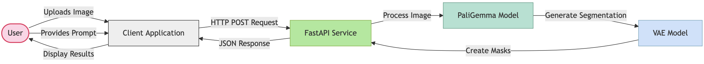
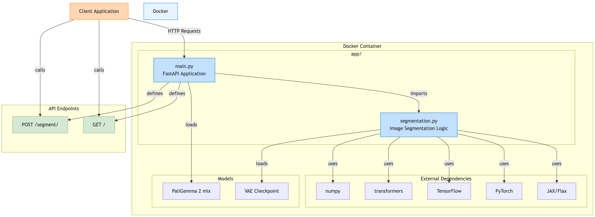

In today's fast-paced machine learning landscape, deploying AI models efficiently is just as important as developing them. In this blog post, we are going to explore how to create an image segmentation application using Google's PaliGemma 2 Mix model, containerized with Docker, and served through a robust FastAPI backend. We are also going to set up a CI/CD pipeline using GitHub Actions to automate buidling the Docker image and pushing it to Docker Hub.

<figure>
  
  <figcaption style="text-align: center">Figure 1. User workflow</figcaption>
</figure>

<figure>
  
  <figcaption style="text-align: center">Figure 2. App architecture</figcaption>
</figure>
