In today’s fast-paced machine learning landscape, deploying AI models is just as important as developing them. In this blog post, we are going to walk through an image segmentation application using Google’s **PaliGemma 2 Mix** model and **transformers**, containerized with **Docker**, and served through a **FastAPI** backend. We are also going to discuss the CI/CD pipeline using **GitHub Actions** to automate building the Docker image and pushing it to Docker Hub. Let’s explore this service, why we chose these technologies, and how you can get started and use the service yourself!

The complete code is available on [GitHub](https://github.com/JoeJoe1313/PaliGemma-Image-Segmentation). 

# What is This Project All About?

At its core, this project provides a **FastAPI service** that allows you to perform image segmentation using natural language. You simply provide as input to the REST API:

- A **text prompt** describing what to segment
- An **image** via URL or file upload
- The specific **PaliGemma 2 model** to perform image segmentation

The service then returns:

- The base64 encoded **model input image**
- The base64 encoded segmentation **masks** clearly outlining the desired objects
- The **bounding box coordinates** for each segmented object

The **FastAPI** application is also containerized with **Docker** for consistent deployment across environments. A CI/CD pipeline with **GitHub Actions** is created for automated container builds and registry publishing to Docker Hub.

# Architectural Blueprint: How It All Works Together

Understanding the flow of data and the interaction of components is key. Let’s first take a look at our project structure:

```plaintext
project_folder/
├── app/
│   ├── __init__.py
│   ├── main.py            # FastAPI application and endpoints
│   └── segmentation.py    # Image segmentation logic
├── models/
│   ├── huggingface/       # Cache directory for Hugging Face models
│   └── vae-oid.npz        # VAE model for mask generation
├── .dockerignore
├── .github/
│   └── workflows/         # GitHub Actions for Docker build and push
│     └── docker-build.yml # Workflow to build and push Docker images
├── .gitignore
├── docker-compose.yml
├── Dockerfile
├── README.md
└── requirements.txt
```

## User & Developer Workflow

Our system is designed with both the end-user and the developer in mind.

```mermaid
graph LR
    User([User]) -->|Provides Image & Prompt| ClientApp[Client Application]
    ClientApp -->|POST Request| FastAPI_Service[FastAPI Service]
    FastAPI_Service -->|Process Input| PaliGemma_Model[PaliGemma Model]
    PaliGemma_Model -->|Generate Segmentation Tokens| VAE_Model[VAE Model]
    VAE_Model -->|Decode Masks| FastAPI_Service
    FastAPI_Service -->|JSON Response | ClientApp
    ClientApp -->|Display Results| User

    Developer([Developer]) -->|Push Code| GitHubRepo[GitHub Repository]
    GitHubRepo -->|Trigger| GitHubActions[GitHub Actions]
    GitHubActions -->|Build & Push Image| DockerRegistry[Docker Hub]
    DockerRegistry -->|Pull Image| DeploymentEnv[Deployment Environment]
    DeploymentEnv -.->|Runs| FastAPI_Service
```


<caption>Figure 1. User & Developer Workflow</caption>

**Figure 1** shows the workflow:

- A **User** interacts with a client application, providing an image and a text prompt, and optionally the specific PaliGemma 2 model.
- The **Client Application** sends an HTTP POST request to our **FastAPI Service**.
- The **FastAPI Service** preprocesses the input and feeds it to the **PaliGemma Model**.
- PaliGemma generates segmentation tokens, which are then passed to the **VAE Model**.
- The VAE Model decodes these into pixel-level masks and, along with bounding boxes, sends them back to the API.
The API returns a JSON response to the client.

To visualize the precise sequence of operations when a user requests an image segmentation, the following diagram details the interactions between the core components:
