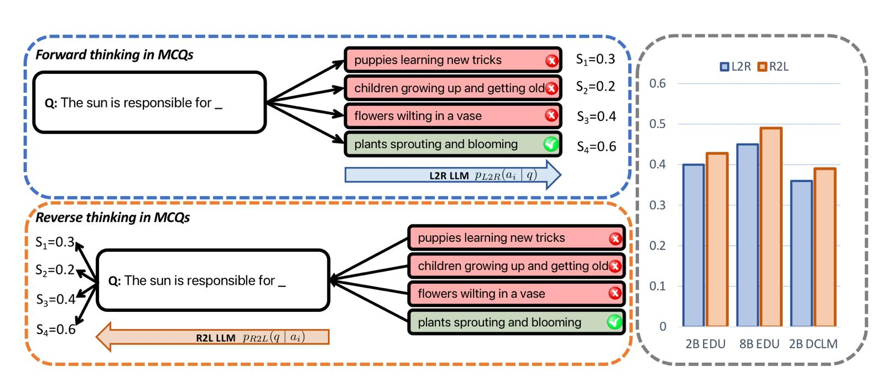
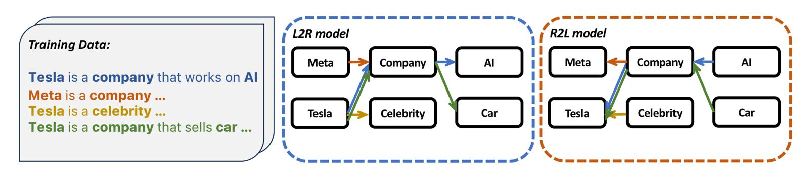
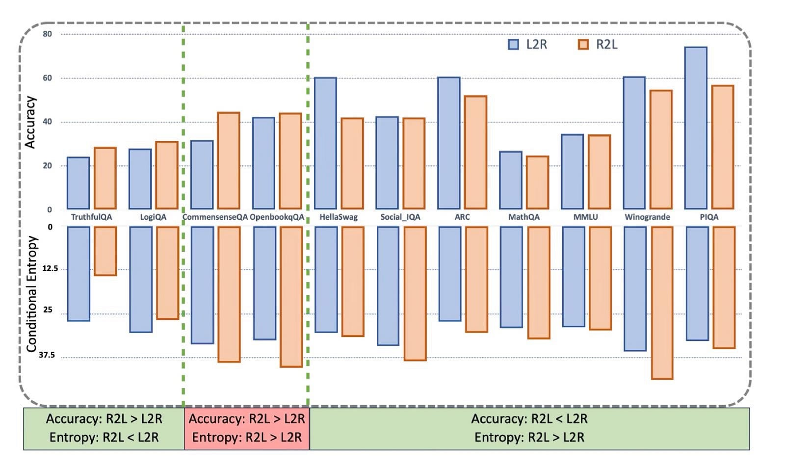
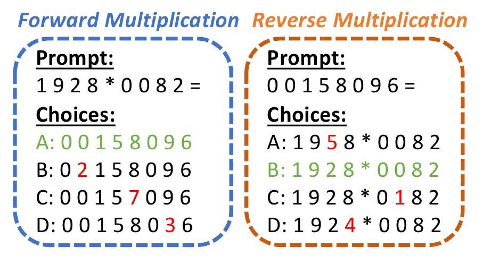

Most modern languages are written from left to right, thus we assume that thinking from left to right is the most natural way to process information expressed with these languages. This is particularly true for **Large Language Models (LLMs)** which are typically trained to predict the next word in a sequence, known as **left-to-right (L2R)** language models. But what if, for certain tasks, thinking backward could actually be better? A recent paper from Apple researchers, titled **_"Reversal Blessing: Thinking Backward May Outpace Thinking Forward in Multi-choice Questions"_**, explores a counterintuitive approach to data augmentation: training LLMs on "reversed" sequences. It delves into the potential of **right-to-left (R2L)** language models, and their effectiveness in tackling some tasks such as **multiple-choice questions (MCQs)**. The paper can be found [here](https://arxiv.org/abs/2502.18435v2), and the supporting code can be found in the GitHub repository [here](https://github.com/apple/ml-reversal-blessing?tab=readme-ov-file). In this blog post, we are going to explore some of the key ideas and findings from this paper, and where needed we are going to provide some additional theoretical beackground and explanations, and simple examples to help us better understand the concepts.

# Left‐to‐right (L2R) Autoregressive Factorization

Most LLMs are trained to predict text in a strictly left‐to‐right order. Left-to-right autoregressive (**L2R**) factorization is the fundamental mathematical principle underlying how large language models generate text. It's based on decomposing the probability of a sequence into conditional probabilities. 

## The Theory

Given a sequence of tokens $x_1,x_2, \dots , x_n$​, the joint probability can be factorized using the chain rule of probability:

$$
p(x_1,x_2,\dots,x_n) = p(x_1)p(x_2∣x_1)p(x_3∣x_1,x_2) \dots p(x_n∣x_1,\dots,x_{n−1})
$$

This can be written more compactly as:

$$
p(x_1,x_2,\dots,x_n) = \prod_{i=1}^n p(x_i∣x_1,\dots,x_{i−1})
$$

The key insight is that we model each token's probability as dependent only on the tokens that came before it (hence "left-to-right"). This creates a causal dependency structure where future tokens cannot influence past tokens. Unfortunately, this approach can introduce inductive biases, errors compounding at each step, and may not be optimal for all reasoning or knowledge‐retrieval tasks. 

Now, let's formally define the L2R factorization with the notation we are going to use throughout the post. For any sequence $x = (x_1, x_2, \dots, x_T)$, we can express the joint probability as

$$
\fbox{
    $p_{L2R}(x) = \prod_{t=1}^{T} p_{L2R}(x_{t}\mid x_{<t})$,
}
$$

where $x_{<t} = (x_{1}, x_{2}, \dots, x_{t-1})$. At each timestep $t$, the model predicts the next token $x_t$ given the full prefix $x_{<t}.$ This factorization is not unique, any valid factorization of the joint probability yields the same marginal $p(x)$.

We are also going to need the log-lokielhood of the sequence, which is

$$
\fbox{
    $\log p_{L2R}(x) = \sum_{t=1}^{T} \log p_{L2R}(x_{t}\mid x_{<t})$.
}
$$

You might wonder why we are going to use the log-likelihood. The most straightforward reasons are:

- **Numerical stability**: Multiplying many small probabilities leads to underflow, whereas adding logs is stable
- **Training objective**: LLMs minimize negative log-likelihood (cross-entropy loss)
- **Easier optimization**: Sums are easier to differentiate than products

For _"The cat sat."_ we would have:

$$
\log p = \log p(\text{The}) + \log p(\text{cat}|\text{The}) + \log p(\text{sat}|\text{The, cat}) + \log p(\text{.}|\text{The, cat, sat})
$$

## How LLMs Implement This

Language models learn to approximate each conditional probability $P(x_i | x_1, \dots, x_{i-1})$ through:

- **Encoder layers** that build rich contextual representations of the preceding tokens
- **Attention mechanisms** that allow each position to attend to all previous positions (but not future ones via causal masking)
- **Output layer** that converts the contextual representation into a probability distribution over the vocabulary

During training, the model sees the entire sequence but uses causal masking to ensure position $i$ only sees tokens $1$ through $i-1$. During inference, generation happens token by token, with each new token sampled from the predicted distribution.

## Example

For the sequence _"The cat sat."_:

| Step $t$ | Context $x_{<t}$      | Model outputs distribution over next token    |     Picked token    |
| :------: | :-------------------- | :-------------------------------------------- | :-----------------: |
|     1    | ( )                   | $P(\text{The})=0.4,\ P(\text{A})=0.3,\dots$ |        The        |       |
|     2    | (The)               | $P(\text{cat}\mid   \text{The})=0.5,\dots$   | cat |
|     3    | (The, cat)        | $P(\text{sat}\mid \text{The cat})=0.6,\dots$ | sat |
|     4    | (The, cat, sat) | $P(\text{.}\mid…)=0.8,\dots$     | .   |

# Right‐to‐left (R2L) Autoregressive Factorization

Right-to-left autoregressive factorization is the mathematical "mirror image" of left-to-right, where we factorize the probability by conditioning each token on all the tokens that come after it instead of before.

## The Theory

Given a sequence of tokens $x_1, x_2, \dots, x_n$​, we can factorize using the chain rule in reverse order:

$$
P(x_1, x_2, \dots, x_n) = P(x_n) P(x_{n-1}|x_n) P(x_{n-2}|x_{n-1}, x_n) \dots P(x_1|x_2, \dots, x_n)
$$

This can be written as:

$$
P(x_1, x_2, \dots, x_n) = \prod_{i=1}^{n} P(x_i | x_{i+1}, \dots, x_n)
$$

This is a bit strange to say it like that, but now each token's probability depends on all the tokens that come after it in the sequence. In simple words, R2L is predicting earlier tokens given later ones. You probably immediately asked "But how?", and later you are going ot see the answer is "With the help of Bayes' rule".

Now, let's also formally define the R2L factorization. For any sequence $x = (x_1, x_2, \dots, x_T)$, we can express the joint probability as

$$
\fbox{
    $p_{R2L}(x) \;=\; \prod_{t=1}^{T} p_{R2L}(x_{t}\mid x_{>t})$,
}
$$

where $x_{>t} = (x_{t+1}, x_{t+2}, \dots, x_T)$. And for the log-likelihood, we have

$$
\fbox{
    $\log p_{R2L}(x) \;=\; \sum_{t=1}^{T} \log p_{R2L}(x_{t}\mid x_{>t})$.
}
$$

Although both L2R and R2L factorizations represent the same distribution $p(x)$ in theory, neural approximations break symmetry: reversed factorization leads to different learned behaviors, calibration properties, and uncertainties.

## Example

| Step $t$ |   Context $x_{>t}$  | Model outputs distribution over $x_t$    | Picked token |
| :----------------: | :----------------- | :--------------------------------------- | :----------: |
|          4         |         ( )         | $P(\text{.})=0.7,\dots$                  |      .     |
|          3         |        (.)        | $P(\text{sat}\mid .)=0.6,\dots$        |     sat    |
|          2         |     (sat, .)    | $P(\text{cat}\mid\text{sat.})=0.5,\dots$     |     cat    |
|          1         | (cat, sat, .) | $P(\text{The}\mid\text{cat sat.})=0.4,\dots$ |     The    |

# Key Questions

The paper investigates the following three questions:

- How to evaluate R2L models on knowledge extraction and basic reasoning tasks? 
- Can R2L factorization match or surpass L2R’s capabilities in knowledge extraction and reasoning for downstream tasks?
- What are underlying factors determining the preference of L2R or R2L factorizations?

# Multiple‐Choice Questions

Multiple‐choice questions (MCQs) are a common benchmark for evaluating an LLM’s knowledge, reasoning, and calibration. As we can see in **Figure 1**, in their simplest form, an MCQ comprises:

- A **question** $q$
- A set of $n$ **candidate answers** $a_1, \dots, a_n$
- Exactly **one correct answer** $a^{*}$ among these $n$ choices

<figure>
  
  <figcaption style="text-align: center">Figure 1. MCQ</figcaption>
</figure>

## L2R on MCQs

Let $q$ be a question with answer candidates $\{a_1, a_2, \dots, a_n\}$. Most L2R‐based LLMs approach MCQs by computing, for each candidate $a_i$, the conditional log‐probability:

$$
\log p_{L2R}(a_i \mid ​q) = \sum_{l=1}^{N_i} \log p_{L2R}(a_i^{(l)} \mid q, a_i^{(<l)}),
$$

where $N_i = |a_i|$ is the token length of answer $a_i$. Normalizing by the answer length $N_i$, we obtain the **forward‐thinking score**

$$
s_i^{(L2R)} = \frac{1}{N_i} \log p_{L2R}(a_i \mid ​q),
$$

and the chosen answer index is

$$
\hat{i} = \arg \max_{i \in \{1, \dots, n\}} s_i^{(L2R)}.
$$

Because the model is trained to maximize $\log p(x)$ in the L2R direction, it is inherently good at predicting a short correct answer string next given a fixed question prefix. However, if the correct answer has multiple valid encodings (e.g., synonyms, morphological variants), the probability mass $p_{L2R}(a_i \mid q)$ may be spread across these variants, reducing the normalized score $s_i^{(L2R)}$.

However, L2R forward thinking can suffer from **surface‐form competition** and calibration issues. For example, if two semantically equivalent answers (“dog” vs. “puppy”) each capture only a portion of the probability mass, the true answer may be penalized just because its mass is split.

## R2L on MCQs

At inference, given a candidate answer $a_i$ and a question $q$, R2L-based LLMs score each candidate by evaluating

$$
\log p_{R2L}(q \mid ​a_i) = \sum_{l=1}^{M_i} \log p_{R2L}(q^{(l)} \mid a_i, q^{(>l)}),
$$

where we concatenate $a_i$ and $q$ into a single sequence $a_i, q$. Denote $M_i = \mid (a_i, q) \mid$, the combined token length.

By Bayes’ rule, for each candidate $a_i$ it follows

$$
\log p(a_i \mid q) = \log p(q \mid a_i) + \log p(a_i) - \log p(q).
$$

Discarding the constant $\log p(q)$ and approximating $\log p(a_i)$ with $\log p_{R2L}(a_i)$, one can define three reverse‐thinking paradigms:

- **Paradigm 1 (Normalized + Prior):**

$$
s_i^{(1)} = \frac{1}{M_i} \log p_{R2L}(q \mid a_i) + \log p_{R2L}(a_i)
$$

- **Paradigm 2 (Unnormalized + Prior):**

$$
\tilde{s}_i^{(2)} = \log p_{R2L}(q \mid a_i) + \log p_{R2L}(a_i)
$$

- **Paradigm 3 (Unnormalized, Uniform Prior):**

$$
s_i^{(3)} = \log p_{R2L}(q \mid a_i)
$$

Empirically, Paradigm 3 — which ignores $\log p(a_i)$ — consistently yields the highest MCQ accuracy across a variety of tasks. By treating all $a_i$ as equally likely apriori, it eliminates the need to estimate $\log p(a_i)$ (which can be noisy) and removes length biases.

Hence, the **reverse‐thinking MCQ** predictor is:

$$
\hat{i}^{(R2L)} = \arg \max_{i \in \{1, \dots, n\}} s_i^{(3)} = \arg \max_{i \in \{1, \dots, n\}} \log p_{R2L}(q \mid a_i).
$$

In practice, one concatenates “answer choice” followed by “question” into a single sequence - each reversed internally for the R2L model—and computes the joint probability of generating the question given the answer.

# Explaining the Performance: Calibration, Computability, and Conditional Entropy

Why Does Reverse Thinking Work? The "3C" Hypotheses

Why does reverse thinking sometimes outperform forward thinking, and vice versa? The authors explore three main hypotheses:

- **Calibration** (Surface‐Form Competition)
- **Computability** (Difficulty of Forward vs. Reverse Tasks)
- **Conditional Entropy** (Uncertainty in Each Direction)

## Calibration and Surface‐Form Competition

### The Calibration Issue

When an L2R model computes $\log p_{L2R}(a_i \mid q)$, it has implicitly learned how answers follow questions in training data. However, two semantically identical answers with different surface forms—say, “dog” vs. “puppy”—can each attract partial probability mass. Concretely, imagine:

$$
p_{L2R}(\text{dog} \mid q) = 0.30, \quad p_{L2R}(\text{puppy} \mid q) = 0.30, \quad p_{L2R}(\text{cat} \mid q) = 0.40.
$$

If the correct answer is conceptually “dog,” the L2R model will choose “cat” (0.40) simply because “dog”’s probability is split. Even after length normalization, this surface‐form competition can cause catastrophic mispredictions. This effect is exacerbated when answers have multiple synonyms, plurals, or morphological variants. 

### Reverse Thinking as Calibration Remedy

Reverse thinking (Paradigm 3) computes:

$$
s_i^{(R2L)} = \log p_{R2L}(q \mid a_i)
$$

Since each candidate $a_i$ is fixed, there is no competition among answer forms when evaluating $p(q \mid a)$. Instead, the model scores how well a given answer explains the question. Returning to the toy example, suppose:

$$
p_{R2L}(q \mid \text{dog}) = p_{R2L}(q \mid \text{puppy}) = 0.90, \quad p_{R2L}(q \mid \text{cat}) = 0.40.
$$

Reverse thinking chooses “dog” (or “puppy”) with equal priority over “cat.” By effectively treating all candidate answers with a uniform prior and focusing solely on $p(q \mid a_i)$, reverse thinking auto‐normalizes over surface forms, eliminating calibration biases.

However, calibration alone does not fully explain why reverse thinking sometimes fails—especially on tasks like HellaSwag or ARC, where surface‐form competition is less pronounced. In these settings, the intrinsic “direction” of reasoning and how tightly the model has learned that direction also matter.

## Computability: Forward vs. Reverse Task Difficulty

A classic analogy from number theory contrasts multiplying primes (easy) with factoring their product (hard). In L2R pretraining, the model effectively learns to “multiply” pieces of text forward; reversing that process (i.e., going from output back to inputs) might be inherently more difficult or simply less represented in the data.

### The Intuition

- **L2R Fine‐Tuning ≈ Forward Computation**

<ul>
The model minimizes cross‐entropy loss to predict the next token given prior tokens:
</ul>

$$
\theta_{min} = \min_{\theta} -E_{x \sim D} \left[ \sum_{t=1}^{T} \log p_{\theta}(x_t \mid x_{<t}) \right].
$$

<ul>
In essence, it’s learning a “forward mapping” from contexts to next‐token predictions, analogous to computing a function $f(\text{context}) \rightarrow \text{next token}$.
</ul>

- **R2L Fine‐Tuning ≈ Reverse Computation**

<ul>
By reversing sequences, the model learns $p(x_t \mid x_{>t})$. Conceptually, this is akin to “inverting” the forward function. If the underlying linguistic process is non‐invertible or highly multi‐modal, R2L training may struggle.
</ul>

Consequently, if an MCQ task fundamentally requires “inverting” a reasoning process—say, inferring a premise from a conclusion—R2L might have an advantage. Conversely, if a task fits the forward generative pattern (e.g., predicting plausible continuations), L2R could be superior.

### Limitations of the Computability Argument

Recent evidence suggests that LLMs are not exact symbolic calculators; they don’t perform true logical inversion but rather approximate patterns seen during training (Mirzadeh et al., 2024; Kambhampati, 2024; Valmeekam et al., 2024). Consequently, the computability perspective alone cannot fully predict performance:

- **MCQs are often “shallow” tasks**. They involve pattern recognition, fact recall, or heuristic reasoning rather than deep symbolic inversion.
- **If LLMs only imitate surface patterns**, then whether a task is “forward” or “reverse” might not strictly follow the prime‐multiplication analogy.

Hence, while computability considerations can help interpret why tasks like arithmetic MCQs (e.g., MathQA) favor L2R, they do not fully capture performance on more semantic tasks such as CommonsenseQA or TruthfulQA.

## Conditional Entropy

Building on calibration and computability, the authors propose conditional entropy as a unified criterion for choosing L2R vs. R2L. Intuitively, if the conditional distribution in one direction is “sharper” (i.e., has lower entropy), then predicting in that direction is inherently easier.

<figure>
  
  <figcaption style="text-align: center">Figure 2. DAGs</figcaption>
</figure>

### Formal Definitions

Let $P_T(q,a)$ denote the joint distribution of question $q$ and correct answer $a$ for a given MCQ task $T$. Define:

- **L2R conditional entropy**

$$
H_{L2R}(T) = \mathbb{E}_{q \sim P_T(q)} \left[ -\sum_{a} p_{L2R}(a \mid q) \log p_{L2R}(a \mid q) \right].
$$

<ul>
This measures the average uncertainty in the model’s distribution over answers given questions.
</ul>

- **R2L conditional entropy**

$$
H_{R2L}(T) = \mathbb{E}_{a \sim P_T(a)} \left[ -\sum_{q} p_{R2L}(q \mid a) \log p_{R2L}(q \mid a) \right].
$$

<ul>
This measures the average uncertainty in the model’s distribution over questions given answers.
</ul>

In principle, $\min \{H_{L2R}, H_{R2L}\}$ indicates the “easier” direction: if $H_{L2R} < H_{R2L}$, forward thinking should yield higher MCQ accuracy; if $H_{L2R} > H_{R2L}$, reverse thinking should dominate.

However, directly computing these entropies is intractable, since for each $q$, summing over all possible $a$ (and vice versa) is exponential. Instead, the authors estimate them via a **Monte Carlo proxy** using one‐sample “rollouts.”

### One‐Sample Rollouts for Entropy Estimation

For each test instance $(q,a^{∗})$ in the domain $T$, perform:

1. **Estimate $\hat{H}_{L2R}$**

    - Generate one candidate answer $\tilde{a}$ by sampling from the learned distribution $p_{L2R}(. \mid q)$. In practice, they generate exactly 10 tokens (without early EOS) to form a sampled answer $\tilde{a}$.
    - Compute $- \log p_{L2R}(\tilde{a} \mid q)$
    - Average this negative log‐probability over all test instances:

$$
\hat{H}_{L2R}(T) = \frac{1}{N_{\text{test}}} \sum_{i=1}^{N_{\text{test}}} \left[ - \log p_{L2R}(\tilde{a_i} \mid q_i) \right].
$$

2. **Estimate $\hat{H}_{R2L}$**

    - For each test instance $(q,a^{∗})$, sample one “pseudo‐question” $\tilde{q}$ from $p_{R2L}(⋅\mid a^{∗})$. Again, they generate 10 tokens in reverse.
    - Compute $- \log p_{R2L}(\tilde{q} \mid a^{∗})$
    - Average this negative log‐probability over all test instances:
$$
\hat{H}_{R2L}(T) = \frac{1}{N_{\text{test}}} \sum_{i=1}^{N_{\text{test}}} \left[ - \log p_{R2L}(\tilde{q_i} \mid a^{∗}_i) \right].
$$

The choice of **exactly 10 tokens** ensures a standardized length, preventing longer generations from inflating entropy estimates.

###  Correlating Entropy with MCQ Accuracy

Plotting the estimated $\hat{H}_{L2R}$ and $\hat{H}_{R2L}$ against MCQ accuracy for all eleven tasks reveals a strong correlation:

- If $\hat{H}_{L2R} < \hat{H}_{R2L}$, then L2R accuracy on $T$ exceeds R2L accuracy on $T$.
- If $\hat{H}_{L2R} > \hat{H}_{R2L}$, then R2L accuracy on $T$ exceeds L2R accuracy on $T$.

Two tasks, **CommonsenseQA** and **OpenbookQA**, are slight outliers (i.e., reverse thinking outperforms despite $\hat{H}_{L2R} < \hat{H}_{R2L}$), suggesting that **calibration or computability** factors also play a role. Nonetheless, **conditional entropy** explains the majority of observed results, providing a principled criterion for choosing processing direction.

Figure 3 below demonstrates this alignment: tasks cluster along a diagonal line when plotting accuracy difference vs. entropy difference. 

<figure>
  
  <figcaption style="text-align: center">Figure 3. Sth</figcaption>
</figure>

#  Controlled Simulation: 4‐Digit Multiplication

To isolate calibration, computability, and entropy effects, the authors design a toy problem: **4‐digit multiplication**. They train L2R and R2L models to perform multiplication (forward) or factorization (reverse) on a dataset of all $10^8$ non‐repeating 4‐digit $\times$ 4‐digit equations.

<figure>
  
  <figcaption style="text-align: center">Figure 4. Sth</figcaption>
</figure>

## Dataset Construction

- **All pairs** $(m,n)$, where $m, n \in \{0000,0001, \dots 9999\}$, excluding trivial repeats (e.g., $(0000,0000)$). There are $10^8$ unique pairs.
- Compute the 8‐digit product $p = m \times n$. (Leading zeros are allowed to fix string length.)

Two parallel tasks:

1. **Forward X (Multiplication)**
   
    - **Input:** Two 4‐digit factors $m$ and $n$, formatted as $m \times n =$.
    - **Target:** 8‐digit product $p$.
    - **Sequence format:** $[m] [\times] [n] [=] [p]$, with each digit and symbol separated by spaces (total length constant across examples).

2. **Reverse X (Factorization)**

    - **Input:** An 8‐digit product $p$, formatted as $p =$.
    - **Target:** The two 4‐digit factors $m$ and $n$.
    - **Sequence format:** $[p] [=] [m] [\times] [n]$, again with fixed token spacing.

By spacing each digit and symbol uniformly, the authors ensure **no length‐based calibration** issues: every example has identical token length during training (fixed number of tokens). Thus, surface‐form competition is minimized, allowing clear investigation of **computability** and **conditional entropy**.

## Model Training

Both L2R and R2L models (identical `2B` architecture) are trained from scratch for one epoch on their respective datasets. Each model sees all $10^8$ unique equations exactly once, ensuring no distribution mismatch.

## MCQ‐Style Testing

From a held‐out set of `1000` test equations, the authors create MCQs with 4 answer choices per example:

- **Forward X MCQ** (Given $(m,n)$, choose the correct product $p$ among four candidates):

    - 1 correct product (true $m \times n$)
    - 3 “hard negatives”: each formed by randomly flipping one digit of the true product to another random digit (ensuring the negative is not a valid product of two 4‐digit numbers in the training set)

- Reverse X MCQ (Given $p$, choose the correct factor pair $(m,n)$ among four candidates):

    - 1 correct factor pair
    - 3 negatives: each formed by changing one digit in either $m$ or $n$ to a random digit (ensuring the negative pair yields the same or different product; some negatives may or may not correspond to $p$)

For each test instance, answer choices are randomly **shuffled** and the process is repeated **10 times** to average out ordering effects.

## Theoretical Conditional Entropy

The forward mapping $(m,n)\rightarrow p$ is **deterministic**: knowing $m$ and $n$ exactly determines $p$. Hence the oracle conditional entropy is

$$
H_{\text{oracle}}(p \mid m, n)  = 0.
$$

Conversely, the reverse mapping $p \rightarrow (m,n)$ can be **many‐to‐one**: a given product $p$ may have multiple valid factor pairs. Over all 4‐digit factors, the expected number of factor pairs for a random 8‐digit number is approximately 2. By basic entropy:

$$
H_{\text{oracle}}((m, n) \mid p) = \ln(\mathbb{E}\left[ \text{\#factor pairs} \right]) \approx \ln(2) \approx 0.69 \text{ nats}.
$$

(Using natural logarithm; if we measured in bits, it would be $\approx 1.0$ bit.) Similarly, in the Reverse X scenario, predicting $(m,n)$ from $p$ has 
$H_{\text{oracle}}((m,n)∣p) \approx 0.69$ nats, whereas predicting $p$ from $(m, n)$ is deterministic ($H=0$).
