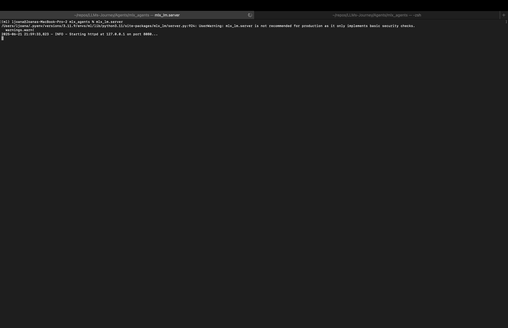

[TOC]

Building intelligent applications that can interact with real-world data requires more than just Large Language Models (LLMs), it requires the ability to call external functions and tools. **Tool calling** transforms a conversational LLM into an agent that can execute code, query APIs, and perform tasks. In this blog post, we are going to create a job search assistant using the **MLX-LM Server**, connect it to the **OpenAI client** , and utilise the **Qwen3-8B** model’s tool‐calling abilities. We are going to build a tool that scrapes job postings from [DEV.BG](https://dev.bg), a popular Bulgarian job board, and provides intelligent responses about available positions. 

Medium post can be found [here](https://medium.com/@levchevajoana/a-job-postings-tool-a-guide-to-mlx-lm-server-and-tool-use-with-the-openai-client-edb9a5d75b4c).

> **Note**: The [PR](https://github.com/ml-explore/mlx-lm/pull/217) for enabling tool use in the mlx-lm server using the openai client is still not merged.

# The MLX-LM Server

`mlx-lm` is a package for running and fine-tuning LLMs using MLX. One component of this library is the `mlx_lm.server`, a lightweight HTTP server designed to serve local MLX models.

## Purpose of the Server

The primary purpose of `mlx_lm.server` is to expose a local LLM through an API. Crucially, this API is designed to be **compatible with the OpenAI API standard**. This is a very useful design choice because it allows interaction with local models using the enormous ecosystem of existing tools built for OpenAI, including their official Python client library.

As we can see from the [source code](https://github.com/ml-explore/mlx-lm/blob/5820cbc5509d2ca74eccc846bccc131ed1fbe7ea/mlx_lm/server.py):

```python
# ... server setup ...
class APIHandler(BaseHTTPRequestHandler):
    def do_POST(self):
        endpoints = {
            "/v1/completions": self.handle_text_completions,
            "/v1/chat/completions": self.handle_chat_completions,
            # ...
        }
# ...
```

the server sets up the endpoints `/v1/chat/completions` and `/v1/models`. When a request hits the `/v1/chat/completions` endpoint, the server processes the prompt, parameters, and, most importantly for our use case, any tool definitions. This compatibility with the OpenAI client takes away the complexity of model loading and inference, providing a clean, **standardized** interface for client applications.

> **Warning!** `mlx_lm.server` is not recommended for production as it only implements basic security checks.

# The Bridge: The OpenAI Client

As already mentioned, probably a bit counterintuitive, we are going to use the official `openai` Python library to run our **local MLX model**. This is possible precisely because the MLX-LM server mimics the OpenAI API.

The trick is to configure the client to point to the local server’s address (`base_url`) instead of pointing it to the OpenAI’s default cloud URL.

```python
from openai import OpenAI

client = OpenAI(
    base_url="http://localhost:8080/v1",  # The address of our mlx_lm.server
    api_key="not-needed",  # No API key is needed for local inference
)
```

This would redirect all API calls (such as `client.chat.completions.create`) from OpenAI’s servers to the local MLX-LM server instance. It also provides a familiar and widely used interface to run LLMs.

# What is Tool Calling?

**Function calling**, also known as **tool calling**, is a feature that allows LLMs to interact with external systems and APIs. Instead of being limited to text generation, models can:

- Execute predefined functions with structured parameters
- Receive function results and incorporate them into responses
- Chain multiple function calls to complete complex tasks
- Provide more accurate, up-to-date information

## How Function Calling Works

The process follows a structured workflow:

- **Function Definition:** Define available functions with detailed schemas
- **Model Reasoning:** The model analyzes user requests and determines which functions to call
- **Parameter Extraction:** The model extracts appropriate parameters for function calls
- **Function Execution:** Your application executes the called functions
- **Result Integration:** The model incorporates function results into its final response

## Function Schema Structure

Functions are defined using JSON schemas that specify parameters, types, and descriptions:

```python
TOOLS = [
    {
        "type": "function",
        "function": {
            "name": "get_todays_jobs",
            "description": "Get the jobs posted on a given date.",
            "parameters": {
                "type": "object",
                "properties": {
                    "date": {
                        "type": "string",
                        "description": "The date to search for jobs. Defaults to 'today'",
                        "default": "today",
                    },
                },
                "required": ["category"],
            },
        },
    }
]
```

# The Brains: Qwen3 and its Tool-Calling Prowess

We are going to use a model from the Qwen3 family (`mlx-community/Qwen3-8B-8bit`). The Qwen models are known for being highly capable, and they have been trained to be good at understanding when and how to use tools.

The `mlx_lm.server` makes use of the specific tokenizer configuration of the model. When handling a chat completion, it checks if the model supports tool calling and uses special tokens to format the prompt correctly, signaling to the model that tools are available.

```python
# ...
# This logic shows the server is aware of the model's tool-calling capabilities
if (
    self.tokenizer.has_tool_calling
    and gen_response.text == self.tokenizer.tool_call_start
):
    in_tool_call = True
# ...
```

This makes the tool-calling process seamless.

# Technical Demo: The Job Postings Tool

Now, it’s time to dive into the code of our job search assistant. The goal is to create a tool named `get_todays_jobs` that can scrape job postings from [DEV.BG](https://dev.bg). We want an assistant that, upon user request, retrieves job postings for a given date and category.

The code for the job tool can be found [here](https://github.com/JoeJoe1313/LLMs-Journey/blob/main/Agents/mlx_agents/jobs_tool_conv.py).

## Step 1: Defining the Tool for the LLM

First, we must describe our tool in a format the LLM can understand. This is a JSON schema that details the function’s name, purpose, and parameters.

```python
TOOLS = [
    {
        "type": "function",
        "function": {
            "name": "get_todays_jobs",
            "description": "Get the jobs posted today or on a given date in a specific job category from dev.bg",
            "parameters": {
                "type": "object",
                "properties": {
                    "category": {
                        "type": "string",
                        "description": "The job category (e.g., 'Data Science', 'Software Development', 'DevOps', etc.)",
                    },
                    "date": {
                        "type": "string",
                        "description": "The date to search for jobs (e.g., 'today', '2024-06-15', 'yesterday'). Defaults to 'today'",
                        "default": "today",
                    },
                },
                "required": ["category"],
            },
        },
    }
]
```

This description is very important. The model uses the `"description"` fields to figure out *when* to call the function and how to extract parameters like `category` and `date` from the user's natural language query.

## Step 2: The Tool’s Core Logic

Next, we should implement the Python function that does the actual work. The `get_todays_jobs` function calls `scrape_dev_bg_jobs`, which uses the `requests` and `BeautifulSoup` libraries to fetch and parse the HTML from the job site.

```python
# From jobs_tool_conv.py

def scrape_dev_bg_jobs(category, target_date):
    """Scrape jobs from dev.bg for a specific category and date"""
    try:
        # ... logic to map category and construct URL ...
        
        # ... network request to dev.bg ...
        response = requests.get(base_url, headers=headers, timeout=10)
        soup = BeautifulSoup(response.content, "html.parser")
        
        # ... parsing logic to find job title, company, date, and link ...
        
        return job_listings

    except Exception as e:
        return f"Error processing jobs data: {str(e)}"


def get_todays_jobs(category, date="today"):
    """Get jobs posted today or on a given date in a specific category from dev.bg"""
    try:
        target_date = parse_date(date) # Handles 'today', 'yesterday', etc.
        jobs = scrape_dev_bg_jobs(category, target_date)
        
        if not jobs:
            return f"No jobs found for category '{category}'..."

        # ... formats the list of jobs into a string ...
        return result

    except Exception as e:
        return f"Error getting jobs: {str(e)}"
```

Some important components of the scraping function are:

### Data Extraction Strategy

The tool uses BeautifulSoup to parse HTML and extract job information:

```python
job_containers = soup.find_all(
    "div", class_=lambda x: x and x.startswith("job-list-item")
)

for job in job_containers:
    title_elem = job.find("h6", class_=lambda x: x and "job-title" in x)
    company_elem = job.find(
        ["span", "div", "p"], class_=re.compile(r"company|employer", re.I)
    )
    date_elem = job.find("span", class_="date")
    link_elem = job.find("a")
```

This approach uses flexible CSS selectors that can adapt to minor changes in the website’s structure.

### Category Mapping System

The tool includes a category mapping system to handle different ways users might refer to job categories:

```python
def get_category_mapping():
    """Map common category names to dev.bg category parameters"""
    return {
        "data science": "data-science",
        "machine learning": "data-science",
        "data": "data-science",
        "backend development": "back-end-development",
        "python development": "python",
    }
```

This mapping allows users to use natural language terms that get converted to the website’s specific URL parameters.

### Step 3: The Conversational Loop

This is where everything comes together. The main loop in `jobs_tool_conv.py` orchestrates the entire conversation.

```python
# From jobs_tool_conv.py

# ... client and available_functions setup ...

while True:
    # 1. Get user input
    user_input = input("You: ")
    messages.append({"role": "user", "content": user_input})

    # 2. Call the LLM with the tools
    response = client.chat.completions.create(
        model=MODEL,
        messages=messages,
        tools=TOOLS,
        tool_choice="auto",
    )
    response_message = response.choices[0].message

    # 3. Check if the LLM wants to call a tool
    while response_message.tool_calls:
        messages.append(response_message)
        for tool_call in response_message.tool_calls:
            function_name = tool_call.function.name
            function_to_call = available_functions[function_name]
            function_args = json.loads(tool_call.function.arguments)

            # 4. Execute the tool
            log.info(
                f"Assistant: Thinking... (Calling tool: {function_name}...)"
            )
            function_response = function_to_call(**function_args)

            # 5. Send the result back to the LLM
            messages.append(
                {
                    "tool_call_id": tool_call.id,
                    "role": "tool",
                    "name": function_name,
                    "content": function_response,
                }
            )

        # Re-call the LLM with the tool's output
        response = client.chat.completions.create(
            model=MODEL, messages=messages, tools=TOOLS, tool_choice="auto"
        )
        response_message = response.choices[0].message

    # 6. Print the final response
    final_content = response_message.content
    log.info(f"Assistant: {final_content}")
    messages.append({"role": "assistant", "content": final_content})
```

As we can see, the application implements a continuous chat interface:

```python
while True:
    user_input = input("You: ")
    if user_input.lower() in ["quit", "exit"]:
        log.info("Assistant: Goodbye!")
        break
        
    messages.append({"role": "user", "content": user_input})
    # ... process response
```

The conversation will continue until the user write `quit` or `exit`. Also, the system maintains conversation context by storing all messages, which allows the model to reference previous questions and maintain context throughout the conversation. The application handles tool calls through a processing loop, which continues until the model no longer needs to call additional functions, ensuring complex multi-step queries can be handled effectively.

```python
while response_message.tool_calls:
    messages.append(response_message)
    
    for tool_call in response_message.tool_calls:
        function_name = tool_call.function.name
        function_to_call = available_functions[function_name]
        function_args = json.loads(tool_call.function.arguments)
        
        function_response = function_to_call(**function_args)
        
        messages.append({
            "tool_call_id": tool_call.id,
            "role": "tool",
            "name": function_name,
            "content": function_response,
        })
    
    # Get next response from model
    response = client.chat.completions.create(...)
```

# Putting It All Together: Commands and Execution

Let’s see how to run the agent.

## Install Dependencies

First, ensure you have `mlx-lm` and the other required Python packages installed.

```bash
pip install mlx-lm openai beautifulsoup4 requests
```

### Start the MLX-LM Server

Open a terminal and run the `mlx_lm.server` command.

```bash
mlx_lm.server
```

You should see output indicating the server has started, by default on `127.0.0.1:8080`.

<figure>
  
  <figcaption style="text-align: center">Figure 1. Start the mlx-lm server</figcaption>
</figure>

### Run the Job Tool Client

Open a *second* terminal and run the client script.

```bash
python jobs_tool_conv.py
```

Now you can chat with your AI assistant.

<figure>
  
  <figcaption style="text-align: center">Figure 2. Run the job tool client</figcaption>
</figure>

Try queries like:

```
You: Are there any new data science jobs?
```

or

```
What are the jobs from today in Data Science category?
```

You are going to see the log messages as the assistant thinks, calls its tool, and then presents the final, formatted list of jobs it found. If jobs are not found it will inform you, and you can try a refined search. If jobs are found and presented, you can continue the conversation with other questions (which can require or not require tool calling — the decision is taken based on the question). To end the conversation you just type `quit` or `exit`. See an example below:

<figure>
  
  <figcaption style="text-align: center">Figure 3. Example conversation</figcaption>
</figure>

If we go back to the terminal we started the server in, we can see the successful POST requests we just made.

<figure>
  
  <figcaption style="text-align: center">Figure 4. Mlx-lm server requests logs</figcaption>
</figure>

# Conclusion

By combining the MLX-LM server, the standardized OpenAI client library, and the power of function calling, along with models like Qwen3 , we can build robust, data‐driven assistants. The job postings demo illustrated how to wire together scraping logic and LLM intelligence into a seamless conversational experience.

*Happy building!*
