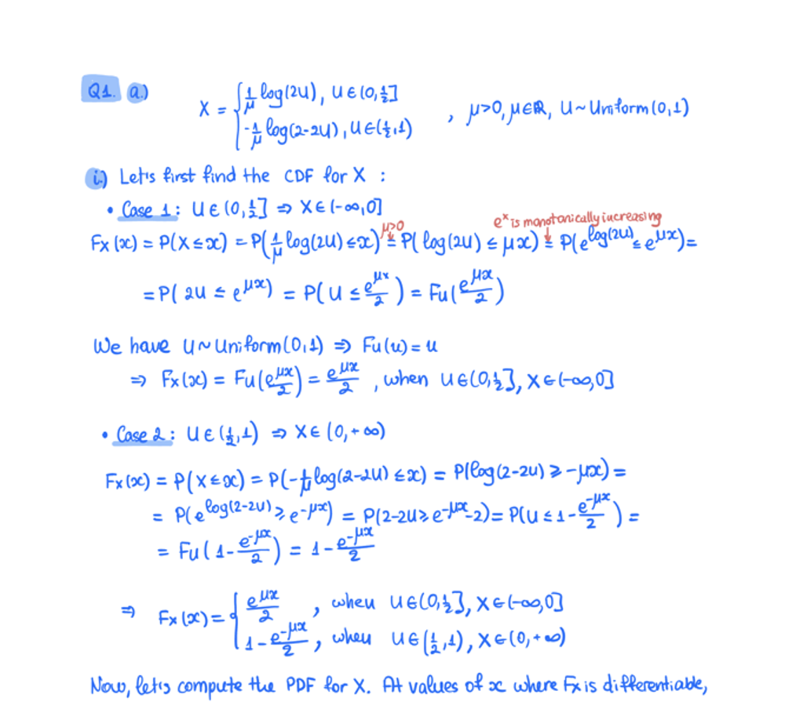

### Prompt:

```
Extract the text from the above document as if you were reading it naturally. 

Return the tables in html format.

Return the equations in LaTeX representation.

If there is an image in the document and image caption is not present, add a small description of the image inside the </img> tag; otherwise, add the image caption inside </img>.

Watermarks should be wrapped in brackets. Ex: <watermark>OFFICIAL COPY</watermark>. 

Page numbers should be wrapped in brackets. Ex: <page_number>14</page_number> or <page_number>9/22</page_number>. 

Prefer using ☐ and ☑ for check boxes.
```

### Input:

<figure>
  
  <figcaption style="text-align: center">Figure 1. Input image</figcaption>
</figure>

### Result:

#### Rendered

Q1. a)

$$X = \begin{cases} \frac{1}{\mu} \log(2u), & u \in (0, \frac{1}{2}] \\ -\frac{1}{\mu} \log(2-2u), & u \in (\frac{1}{2}, 1) \end{cases}, \mu > 0, \mu \in \mathbb{R}, u \sim \text{Uniform}(0,1)$$

i) Let's first find the CDF for $X$:

- **Case 1:** $u \in (0, \frac{1}{2}] \Rightarrow X \in (-\infty, 0]$

$$F_X(x) = P(X \leq x) = P\left(\frac{1}{\mu} \log(2u) \leq x\right) = P\left(\log(2u) \leq \mu x\right) = P\left(e^{\log(2u)} \leq e^{\mu x}\right) =$$

$$= P(2u \leq e^{\mu x}) = P(u \leq \frac{e^{\mu x}}{2}) = F_U\left(\frac{e^{\mu x}}{2}\right)$$

We have $u \sim \text{Uniform}(0,1) \Rightarrow F_U(u) = u$

$$\Rightarrow F_X(x) = F_U\left(\frac{e^{\mu x}}{2}\right) = \frac{e^{\mu x}}{2}, \text{ when } u \in (0, \frac{1}{2}], x \in (-\infty, 0]$$

- **Case 2:** $u \in (\frac{1}{2}, 1) \Rightarrow X \in (0, +\infty)$

$$F_X(x) = P(X \leq x) = P(-\frac{1}{\mu} \log(2-2u) \leq x) = P(\log(2-2u) \geq -\mu x) =$$

$$= P(e^{\log(2-2u)} \geq e^{-\mu x}) = P(2-2u \geq e^{-\mu x}) = P(u \leq 1 - \frac{e^{-\mu x}}{2}) =$$

$$= F_U(1 - \frac{e^{-\mu x}}{2}) = 1 - \frac{e^{-\mu x}}{2}$$

$$\Rightarrow F_X(x) = \begin{cases} \frac{e^{\mu x}}{2}, & \text{when } u \in (0, \frac{1}{2}], x \in (-\infty, 0] \\ 1 - \frac{e^{-\mu x}}{2}, & \text{when } u \in (\frac{1}{2}, 1), x \in (0, +\infty) \end{cases}$$

Now, let's compute the PDF for $X$. At values of $x$ where $F_X$ is differentiable,

#### Plain Text

```latex
Q1. a)

$$X = \begin{cases} \frac{1}{\mu} \log(2u), & u \in (0, \frac{1}{2}] \\ -\frac{1}{\mu} \log(2-2u), & u \in (\frac{1}{2}, 1) \end{cases}, \mu > 0, \mu \in \mathbb{R}, u \sim \text{Uniform}(0,1)$$

i) Let's first find the CDF for $X$:

- **Case 1:** $u \in (0, \frac{1}{2}] \Rightarrow X \in (-\infty, 0]$

$$F_X(x) = P(X \leq x) = P\left(\frac{1}{\mu} \log(2u) \leq x\right) = P\left(\log(2u) \leq \mu x\right) = P\left(e^{\log(2u)} \leq e^{\mu x}\right) =$$

$$= P(2u \leq e^{\mu x}) = P(u \leq \frac{e^{\mu x}}{2}) = F_U\left(\frac{e^{\mu x}}{2}\right)$$

We have $u \sim \text{Uniform}(0,1) \Rightarrow F_U(u) = u$

$$\Rightarrow F_X(x) = F_U\left(\frac{e^{\mu x}}{2}\right) = \frac{e^{\mu x}}{2}, \text{ when } u \in (0, \frac{1}{2}], x \in (-\infty, 0]$$

- **Case 2:** $u \in (\frac{1}{2}, 1) \Rightarrow X \in (0, +\infty)$

$$F_X(x) = P(X \leq x) = P(-\frac{1}{\mu} \log(2-2u) \leq x) = P(\log(2-2u) \geq -\mu x) =$$

$$= P(e^{\log(2-2u)} \geq e^{-\mu x}) = P(2-2u \geq e^{-\mu x}) = P(u \leq 1 - \frac{e^{-\mu x}}{2}) =$$

$$= F_U(1 - \frac{e^{-\mu x}}{2}) = 1 - \frac{e^{-\mu x}}{2}$$

$$\Rightarrow F_X(x) = \begin{cases} \frac{e^{\mu x}}{2}, & \text{when } u \in (0, \frac{1}{2}], x \in (-\infty, 0] \\ 1 - \frac{e^{-\mu x}}{2}, & \text{when } u \in (\frac{1}{2}, 1), x \in (0, +\infty) \end{cases}$$

Now, let's compute the PDF for $X$. At values of $x$ where $F_X$ is differentiable,
```