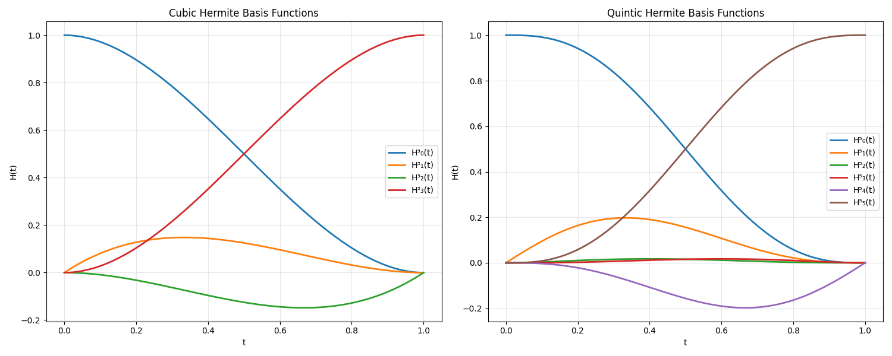
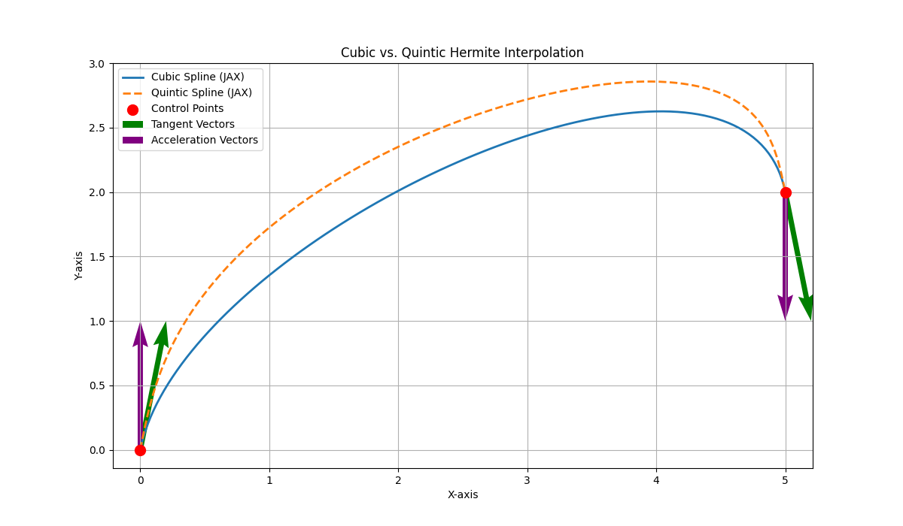
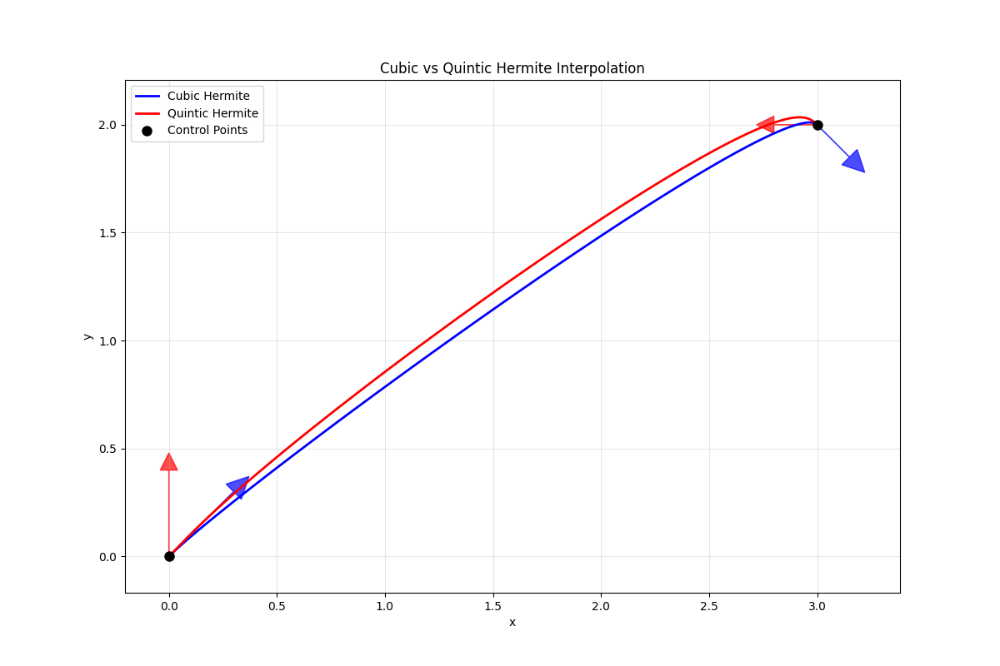

Hermite interpolation is a method for constructing smooth polynomial curves that pass through specified points while also satisfying constraints on the curve's derivatives at those points. Unlike simple polynomial interpolation that only specifies points, Hermite interpolation gives us control over the curve's velocity (first derivative) and acceleration (second derivative) at the control points. In this blog post, we are going to explore both cubic and quintic Hermite interpolation, introduce the theory behind them, and implement them using the MLX framework.

The additional control makes Hermite interpolation particularly valuable for applications where smoothness matters:

- Animation: Ensuring smooth motion with controlled acceleration
- Robotics: Planning trajectories with continuous velocity and acceleration
- Computer Graphics: Creating visually pleasing curves and surfaces

{ width=50% }{ width=50% }

# Cubic Hermite Interpolation

# Quintic Hermite Interpolation

# Piecewise Curves: Building Complex Paths

