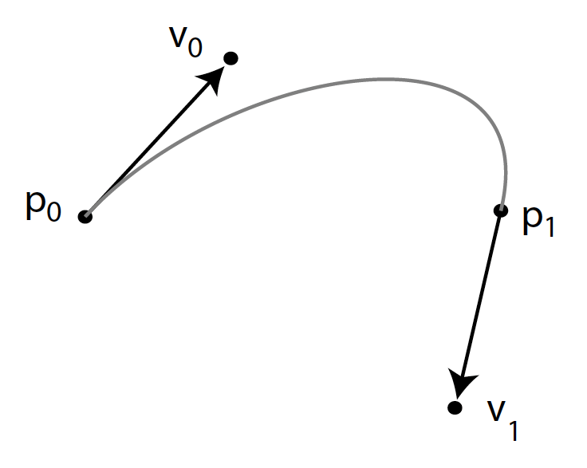
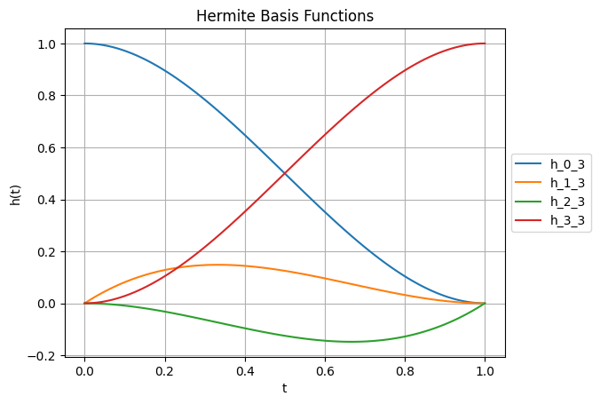
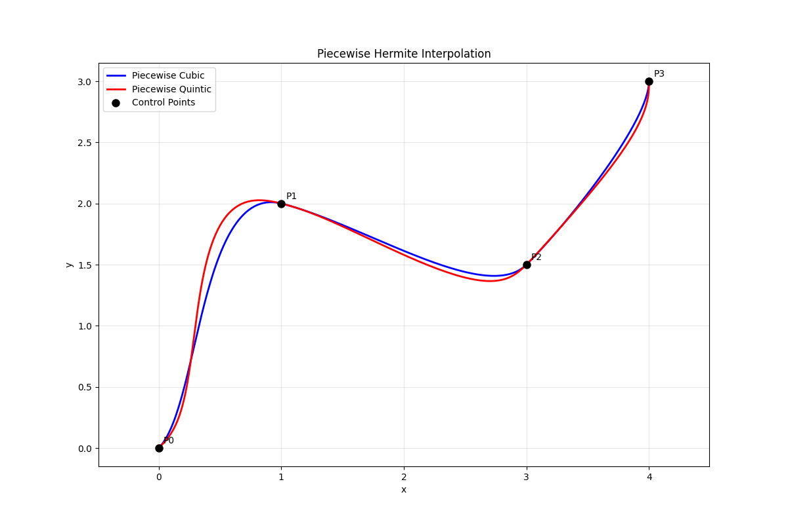
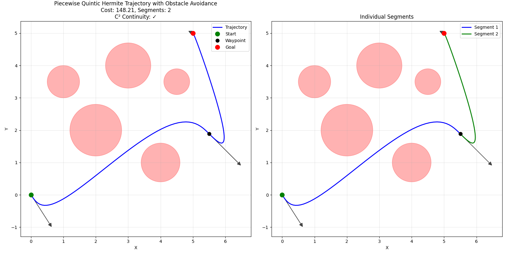
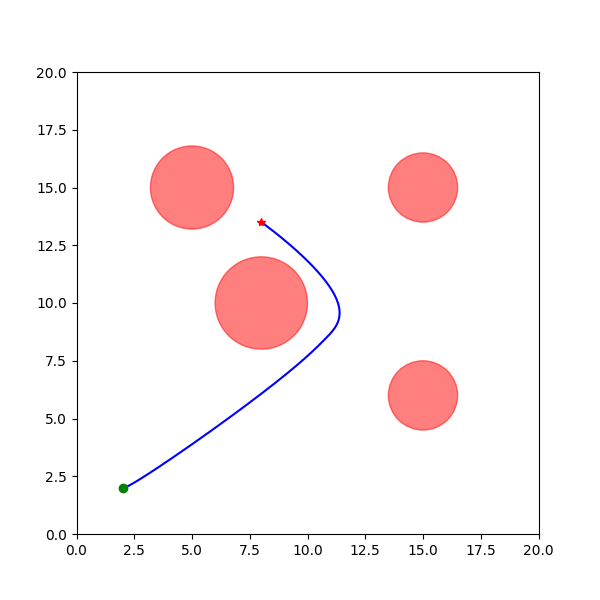

Intro ...

# Cubic Hermite Interpolation

Intro ...

<figure>
  
  <figcaption style="text-align: center">Figure 1. Cubic Hermite Curve</figcaption>
</figure>

We look for a curve 

$$
c(t) = a_0 + a_1 t + a_2 t^2 + a_3 t^3
$$

that satisfies

$$
\begin{cases}
c(0) = p_0, \quad c^{\prime}(0) = v_0 \\
c(1) = p_1, \quad c^{\prime}(1) = v_1
\end{cases},
$$

or we should solve the following system

$$
\begin{cases}
p_0 = a_0 \\
v_0 = a_1 \\
p_1 = a_0 + a_1 + a_2 + a_3 \\
v_1 = a_1 + 2a_2 + 3a_3
\end{cases}.
$$

which gives us the curve parameters we want in terms of the given data

$$\begin{cases}
a_0 = p_0 \\
a_1 = v_0 \\
a_2 = 3p_1 - 3p_0 - 2v_0 - v_1 \\
a_3 = -2p_1 + 2p_0 + v_0 + v_1
\end{cases}.
$$

If we rearrange the terms for $c(t)$ we get

$$
c(t) = (1 - 3t^2 + 2t^3)p_0 + (t - 2t^2 + t^3)v_0 + (-t^2 + t^3)v_1 + (3t^2 - 2t^3)p_1
$$

or in basis function form

$$
c(t) = H_0^3(t)p_0 + H_1^3(t)v_0 + H_2^3(t)v_1 + H_3^3(t)p_1,
$$

where

$$
\begin{cases}
H_0^3(t) = 1 - 3t^2 + 2t^3 \\
H_1^3(t) = t - 2t^2 + t^3 \\
H_2^3(t) = -t^2 + t^3 \\
H_3^3(t) = 3t^2 - 2t^3
\end{cases}.
$$

Plotting the Cubic Hermite basis functions

<figure>
  
  <figcaption style="text-align: center">Figure 2. Cubic Hermite basis functions</figcaption>
</figure>

# Quintic Hermite Interpolation

# Piecewise Curves: Building Complex Paths

# Experiments

 -->
