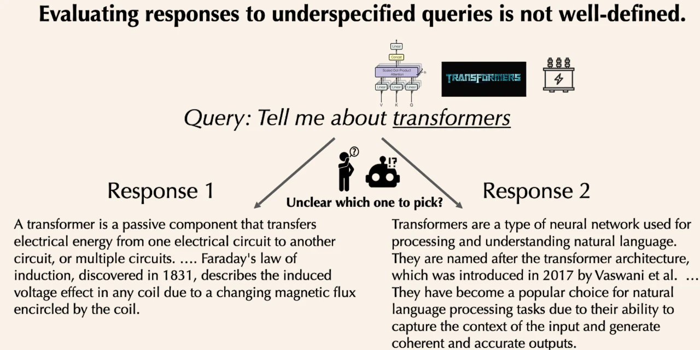
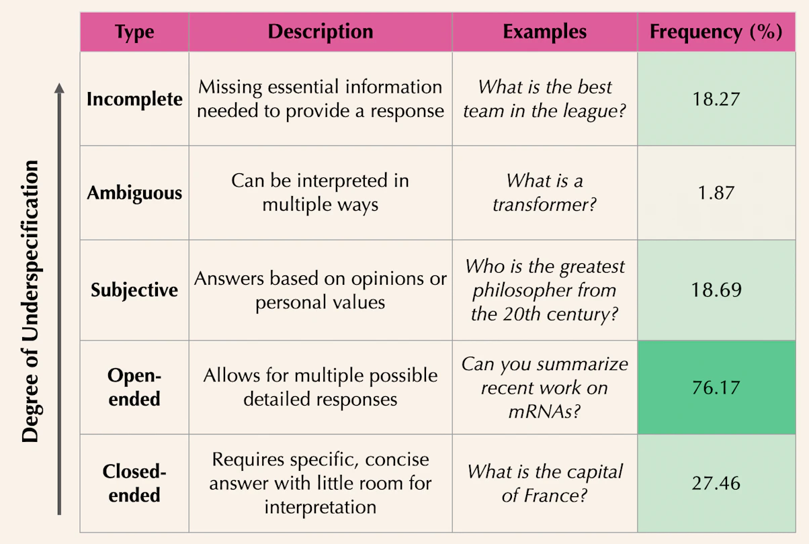
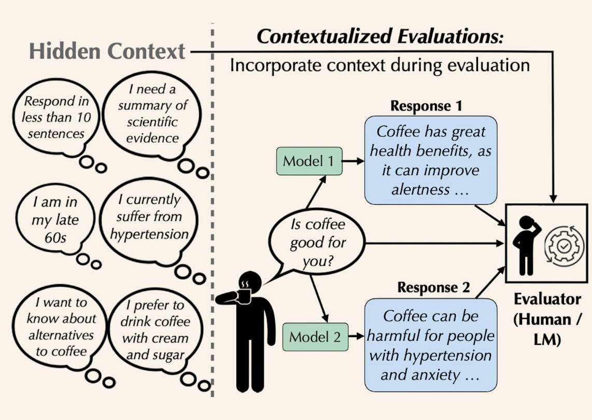

_"When we ask a language model a question, we often leave out important context. A query like, "Is coffee good for you?" seems straightforward, but a quality response depends on hidden context about the user (e.g., does the user have high blood pressure? Are they pregnant?)."_

<figure>
  
  <figcaption style="text-align: center">Figure 1. No context makes it hard to determine the better answer for “Tell me about transformers” (<a href="https://allenai.org/blog/contextualized-evaluations">source</a>)</figcaption>
</figure>

New research from Ai2, **"Contextualized Evaluations: Judging Language Model Responses to Underspecified Queries"**, reveals a major flaw in how we benchmark language models. When we ask vague questions like **_"Is coffee good for you?"_** or **_"Tell me about transformers"_**, we're missing crucial context that determines what makes a good response.

### The problem:

$\sim 76\%$ of queries in major AI benchmarks are underspecified, leading to inconsistent evaluations and unreliable model rankings.

<figure>
  
  <figcaption style="text-align: center">Figure 2. Types of underspecified queries (<a href="https://allenai.org/blog/contextualized-evaluations">source</a>)</figcaption>
</figure>

### The solution:

**_"Contextualized Evaluations"_** – adding synthetic context through follow‑up questions before evaluation. For example, that coffee question needs to know: _Are you pregnant? Do you have high blood pressure?_

<figure>
  
  <figcaption style="text-align: center">Figure 3. Contextualized Evaluations (<a href="https://allenai.org/blog/contextualized-evaluations">source</a>)</figcaption>
</figure>

### Key findings:

&emsp; ✅ Context improves evaluator agreement by 3–10%

&emsp; ✅ Can completely flip model rankings

&emsp; ✅ Shifts focus from style to actual usefulness

&emsp; ✅ Reveals models have a "WEIRD bias" – defaulting to responses for Western, educated, wealthy users

### Why this matters:

Current AI leaderboards might not reflect how well models actually serve diverse users or adapt to specific needs. This research offers a simple way to make AI evaluations more reliable and inclusive.

### Read more:

&emsp; 📬 **Blog post:** [https://allenai.org/blog/contextualized-evaluations](https://allenai.org/blog/contextualized-evaluations)

&emsp; 🗒️ **Paper:** [https://arxiv.org/abs/2411.07237](https://arxiv.org/abs/2411.07237)

&emsp; 💻 **Code:** [https://github.com/allenai/ContextEval](https://github.com/allenai/ContextEval)

&emsp; 📊 **Data:** [https://huggingface.co/datasets/allenai/ContextEval](https://huggingface.co/datasets/allenai/ContextEval)
