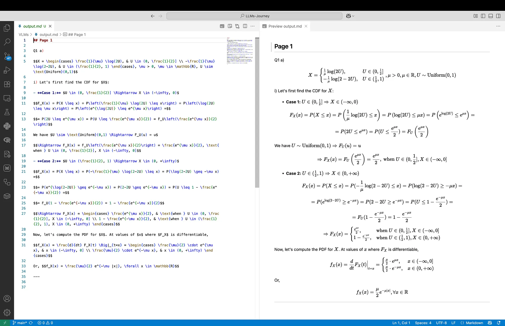

Nanonets has released [Nanonets-OCR-s](https://nanonets.com/research/nanonets-ocr-s/), a state-of-the-art small **3B** image-to-markdown OCR model that goes far beyond traditional text extraction. The model is available on [Hugging Face](https://huggingface.co/nanonets/Nanonets-OCR-s) and integrated with their [docext](https://github.com/NanoNets/docext) tool for immediate use. Medium post can be found [here](https://medium.com/@levchevajoana/nanonets-ocr-a-small-gem-for-handwritten-notes-3fd069b76e78).

Unlike conventional OCR systems that only extract plain text, Nanonets-OCR-s understands document structure and content context, converting documents into structured markdown ready for LLM processing.

**Key Capabilities:**

- **LaTeX Equation Recognition** — converts mathematical formulas to proper LaTeX syntax with `$...$` for inline and `$$...$$` for display equations
- **Intelligent Image Description** — describes charts, graphs, and visuals within structured tags ``
- **Signature Detection & Isolation** — identifies signatures separately from regular text and outputs them within a `<signature>` tag
- **Watermark Extraction** — detects and extracts watermark text within a `<watermark>` tag
- **Smart Checkbox Handling** — converts checkboxes, radio buttons to Unicode symbols
- **Complex Table Extraction** — transforms tables into markdown/HTML format

**Training:** The model was trained on over 250,000 pages comprising research papers, financial documents, legal documents, healthcare documents, tax forms, receipts, and invoices. It uses **Qwen2.5-VL-3B** as the base model, fine-tuned on both synthetic and manually annotated datasets.

> **Note:** The team seems to be experimenting with a 7B version version of the model based on Qwen2.5-VL-7B. Refer to the following [comment](https://huggingface.co/nanonets/Nanonets-OCR-s/discussions/2#684ddb4c8f8fe9eacccd2e65).

---

In the original Nanonets blog [post](https://nanonets.com/research/nanonets-ocr-s/) it is stated the model has not been trained on handwritten text. Out of curiosity I tested the model on handwritten math notes, and I was pretty impressed with the results such a small model produced. Thus, let’s put **Nanonets-OCR-s** to the test, and challenge it with handwritten notes.

For the purpose, we are going to use **mlx-vlm**, and compare it to one of the most used large language models for OCR: **Mistral OCR**. First, I have converted the weights of the originally published by Nanonets [model](https://huggingface.co/nanonets/Nanonets-OCR-s) on Hugging Face to [mlx suitbale weights](https://huggingface.co/mlx-community/Nanonets-OCR-s-bf16). In this post we are going to use **mlx-community/Nanonets-OCR-s-bf16**.

# Tutorial

We are going to cover two main tasks:

- **Image processing:** Direct OCR on handwritten mathematical notes
- **PDF processing:** Processing of multi-page documents

For testing purposes, we are going to use two sample images (see **Figure 1** below), containing handwritten mathematical equations and graphs to evaluate the model’s performance on content it wasn’t specifically trained for.

<figure style="display: flex; justify-content: center; gap: 1rem; margin: 0;">
  <div>
    
  </div>
  <div>
    
  </div>
</figure>
<figcaption style="text-align: center; width: 100%; margin-top: 0.5rem;">
    Figure 1. Left: Input 1 containing equations | Right: Input 2 containing equations and a graph
</figcaption>

## Process an Image

> **Note:** We are going to use mlx-vlm version 0.1.27 because at the moment of writing this post there are some issues with the higher versions.

First, we need to load the necessary libraries:

```python
from mlx_vlm import apply_chat_template, generate, load
from mlx_vlm.utils import load_image
```

Next, we load the MLX-converted Nanonets OCR model:

```python
model_path = "mlx-community/Nanonets-OCR-s-bf16"
model, processor = load(model_path)
config = model.config
```

Now, we have to load the image:

```python
image_path = "../images/sc_1.png"
image = load_image(image_path)
```

The prompt is crucial for getting optimal results. Here, we use the prompt from the Nanonet’s usage example given in the [original model card](https://huggingface.co/nanonets/Nanonets-OCR-s) in Hugging Face.

```python
prompt = (
    "Extract the text from the above document as if you were reading it naturally. "
    "Return the tables in html format. Return the equations in LaTeX representation. "
    "If there is an image in the document and image caption is not present, add a small description of the image inside the </img> tag; otherwise, add the image caption inside </img>. " 
    "Watermarks should be wrapped in brackets. Ex: <watermark>OFFICIAL COPY</watermark>. "
    "Page numbers should be wrapped in brackets. Ex: <page_number>14</page_number> or <page_number>9/22</page_number>. Prefer using ☐ and ☑ for check boxes."
)
```

We structure the input as a conversation format that the model expects:

```python
messages = [
    {"role": "system", "content": "You are a helpful assistant."},
    {"role": "user", "content": [
        {"type": "image", "image": f"file://{image_path}"},
        {"type": "text", "text": prompt},
    ]},
]
formatted_prompt = apply_chat_template(
    processor, config, messages
)
```

And finally, we generate a model output:

```python
generate(model, processor, formatted_prompt, image, verbose=True, max_tokens=2000)
```

## Process a PDF

For processing of multi-page documents, we extend our approach to handle PDF files by converting them to images first. We need `pdf2image` to convert the PDF to an array of `PIL.PpmImagePlugin.PpmImageFile` objects, one for each page:

```python
from mlx_vlm import apply_chat_template, generate, load
from pdf2image import convert_from_path
from tqdm.notebook import tqdm
```

The conversion is done by using the function `convert_from_path`:

```python
pdf_path = "../pdfs/Hermite Interpolation.pdf"
images = convert_from_path(pdf_path)
```

We should set the prompt:

```python
prompt = (
    "Extract the text from the above document as if you were reading it naturally. "
    "Return the tables in html format. Return the equations in LaTeX representation. "
    "If there is an image in the document and image caption is not present, add a small description of the image inside the </img> tag; otherwise, add the image caption inside </img>. " 
    "Watermarks should be wrapped in brackets. Ex: <watermark>OFFICIAL COPY</watermark>. "
    "Page numbers should be wrapped in brackets. Ex: <page_number>14</page_number> or <page_number>9/22</page_number>. Prefer using ☐ and ☑ for check boxes."
)
```

The loop processes each page individually, resizing images to a consistent dimension (850x1100) for optimal model performance, and saves the output to a structured markdown file.

```python
for idx, image in tqdm(enumerate(images), total=len(images), desc="Processing pages"):
    model_path = "mlx-community/Nanonets-OCR-s-bf16"
    model, processor = load(model_path)
    config = model.config

    image = image.resize((850, 1100))
    messages = [
        {"role": "system", "content": "You are a helpful assistant."},
        {
            "role": "user",
            "content": [
                {"type": "image", "image": image},
                {"type": "text", "text": prompt},
            ],
        },
    ]
    formatted_prompt = apply_chat_template(processor, config, messages)
    output = generate(
        model, processor, formatted_prompt, [image], verbose=True, max_tokens=2000
    )
    print(f"Finished generating page {idx} with {output[1]}")
    with open("output.md", "a", encoding="utf-8") as f:
        f.write(f"## Page {idx+1}\n\n")
        f.write(output[0])
        f.write("\n\n---\n\n")
    print(f"Finished writing page {idx}")
```  

> **Note:** We are manually adding page number headlines and lines to separate the pages in the markdown.

In theory, we can also directly pass all of the image pages to the prompt so they can be processed simultaneously, but in practice this is not very optimal if we are GPU poor (like me). An example notebook with the above code can be found [here](https://github.com/JoeJoe1313/LLMs-Journey/blob/main/VLMs/nanonets_handwritten_maths.ipynb).

# Performance on Handwritten Math Notes

Despite not being explicitly trained on handwritten text, **Nanonets-OCR-s** demonstrates remarkable capability in recognising handwritten mathematical notation. Let’s see the model output using the original example prompt

> Extract the text from the above document as if you were reading it naturally. Return the tables in html format. Return the equations in LaTeX representation. If there is an image in the document and image caption is not present, add a small description of the image inside the </img> tag; otherwise, add the image caption inside </img>. Watermarks should be wrapped in brackets. Ex: <watermark>OFFICIAL COPY</watermark>. Page numbers should be wrapped in brackets. Ex: <page_number>14</page_number> or <page_number>9/22</page_number>. Prefer using ☐ and ☑ for check boxes.

and also compare the results with **Mistral OCR**’s output([example code](https://github.com/JoeJoe1313/LLMs-Journey/blob/main/VLMs/mistral_handwritten.ipynb)).

## Input 1

In **Figure 2** below, on the left we can see the output from the Nanonets model. On the right we can examine the rendered result. Generally, the output preserves the structure, and the equation’s content. The red note is missing, on one line I noticed a -2 missing, and in one place instead of curly brackets {}, we can see the classical ones (). The formatting is following the original note, and even the cases are bold.

<figure>
  
  <figcaption style="text-align: center">Figure 2. Nanonets output for Input 1</figcaption>
</figure>

In **Figure 3** below we can see the output from the Mistral OCR model. The output preserves the structure, but there are some problems with the equation’s content. The red note is missing as well, but the one line with a -2 missing is ok here, and the curly brackets {} are present. However, in Case 1 we can see some nonsense and missing = signs. Also, the line before Case 1 starts with (1) and not (i), which was correct in the Nanonets output. The formatting is following the original note, but this time the cases are not bold.

<figure>
  
  <figcaption style="text-align: center">Figure 3. Mistral OCR output for Input 1</figcaption>
</figure>

## Input 2

In **Figure 4** and **Figure 5** below we can see the outputs for Input 2, which consists of less complex content but includes a diagram. Both models produce accurate outputs, however, both of them miss the diagram. In the Mistral OCR output we can see that Cubic Hermite Interpolation is treated as a headline.

<figure>
  
  <figcaption style="text-align: center">Figure 4. Nanonets output for Input 2</figcaption>
</figure>

<figure>
  
  <figcaption style="text-align: center">Figure 5. Mistral OCR output for Input 2</figcaption>
</figure>

What we can notice for the raw LaTeX output is that Mistral OCR formats the output with more new lines, always having a new line before and after each display equation.

> While impressive for a model not specifically trained on handwritten content, we should not forget that performance varies significantly with handwriting quality. Here, these were my notes written on an iPad using [Notability](https://notability.com), and then converted to PDF. The handwriting is easily readable, the notes are well structured, and are of high quality.

# Conclusion

Nanonets-OCR-s proves to be a remarkably capable small model for OCR tasks, just with 3B parameters. Its ability to handle handwritten notes despite not being trained on such data demonstrates the model’s robust generalization capabilities. The structured markdown output, and LaTeX equation conversion make it particularly valuable for academic and research applications. **This would have been a dream come true while I was studying for my bachelor’s degree in Applied Mathematics just a few years ago.**
