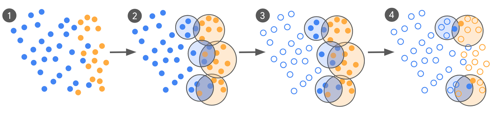
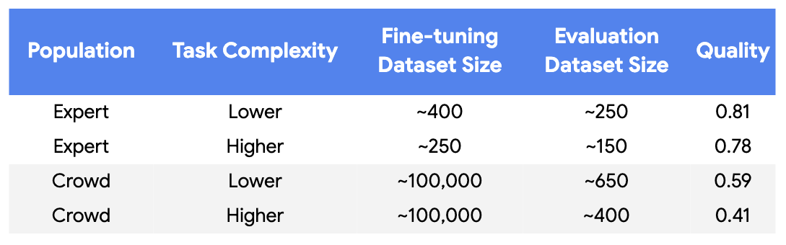
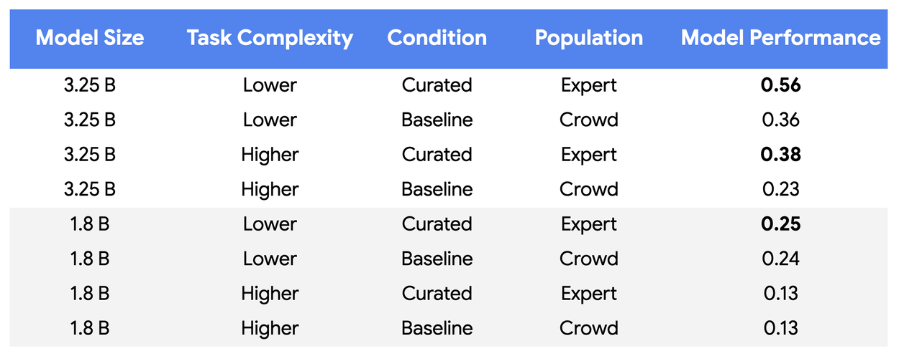

Google just showed it is possible to **reduce LLM training data by up to 10,000x** while maintaining or even improving model performance!

### Active-Learning Loop 

Instead of labelling massive datasets, their **active-learning** loop does this:

1️⃣ **Pre-label:** Use a zero/few-shot LLM to label a large data pool

2️⃣ **Mine decision boundaries:** Apply clustering to identify “confusing” examples where positive and negative classifications overlap (the most informative cases for model learning)

3️⃣ **Expert review:** Send only these challenging boundary cases to human experts for high-fidelity labeling

4️⃣ **Iterate and refine:** Fine-tune the model, re-mine new disagreements, and track model-expert alignment using **Cohen's** $\kappa$ until convergence

<figure>
  
  <figcaption style="text-align: center">Figure 1. Curation process</figcaption>
</figure>

### Results:

✅ Reduced labeling from **~100K** crowd-sourced labels to just **~250-450** expert labels over **5-6 iterations**

<figure>
  
  <figcaption style="text-align: center">Figure 2. Size and quality of datasets used for the baseline and curated conditions</figcaption>
</figure>

✅ Achieved **55-65%** higher model-expert alignment on a 3.25B parameter model

<figure>
  
  <figcaption style="text-align: center">Figure 3. Performance of models trained in curated and baseline conditions</figcaption>
</figure>

✅ In production environments: **up to 10,000x** data reduction with equal or superior quality

### The core insight:

Strategic labelling focused on decision boundaries where models struggle yields far better results than random sampling across large datasets.

### Read more:

&emsp; 📬 **Blog post:** [https://research.google/blog/achieving-10000x-training-data-reduction-with-high-fidelity-labels/](https://research.google/blog/achieving-10000x-training-data-reduction-with-high-fidelity-labels/)
