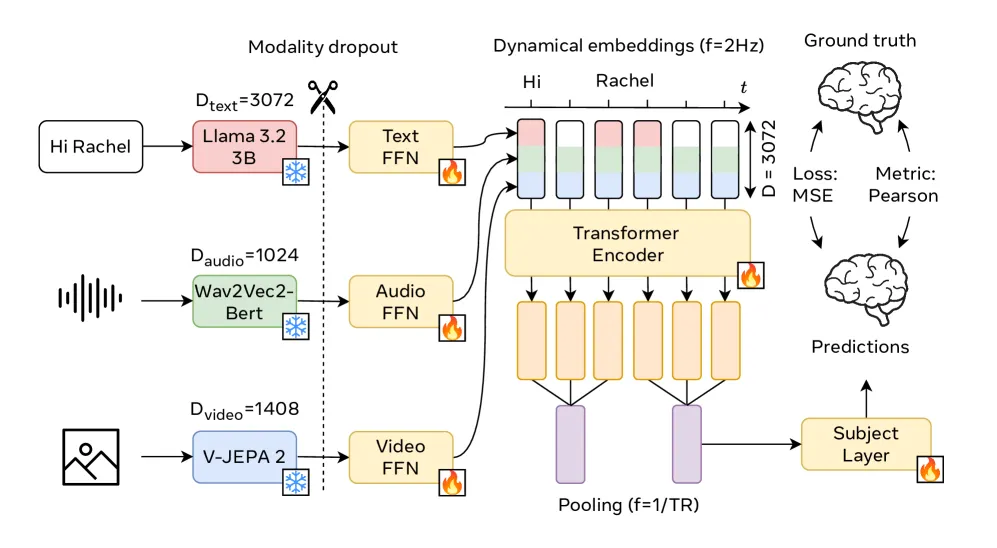

Researchers from Meta have developed **TRIBE** (TRImodal Brain Encoder), the **first** deep encoding pipeline trained across **text** + **audio** + **video**, multiple **cortical areas**, and **individuals**, winning **1st place** in **Algonauts 2025**.

TRIBE fuses features from **Llama-3.2-3B** (text), **Wav2Vec2-BERT** (audio), and **V-JEPA-2** (video) with a **temporal Transformer** and **subject embeddings** to predict **1,000-parcel fMRI** responses to naturalistic videos. The architecture is available in **Figure 1** bloew.

<figure>
  
  <figcaption style="text-align: center">Figure 1. TRIBE architecure</figcaption>
</figure>

### Why it’s cool

&emsp; ✅ Late **fusion of strong unimodal FMs** > unimodal or VL-only baselines

&emsp; ✅ Learns shared dynamics via **subject embeddings**

&emsp; ✅ Robust to missing inputs with **modality dropout**

&emsp; ✅ **Generalizes OOD**: cartoons, documentaries, even silent B&W

### Key results

&emsp; 🥇 1st on **Algonauts 2025** public leaderboard

&emsp; 📊 Captures **~54% of explainable variance** on average

&emsp; 🔬 Trained/evaluated on **80+ hours** of fMRI per participant

&emsp; ⚡ **Up to ~30% higher** encoding scores in associative cortices vs the best unimodal model

### Read more

&emsp; 📄 **Paper:** [https://www.arxiv.org/abs/2507.22229](https://www.arxiv.org/abs/2507.22229)

&emsp; 💻 **Code:** [https://github.com/facebookresearch/algonauts-2025](https://github.com/facebookresearch/algonauts-2025)
