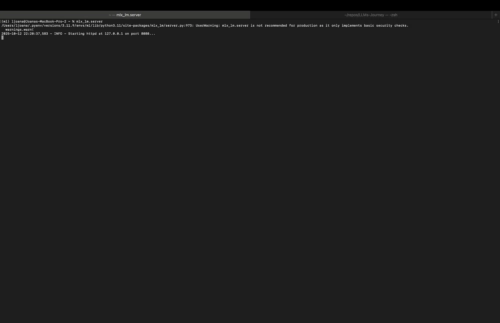
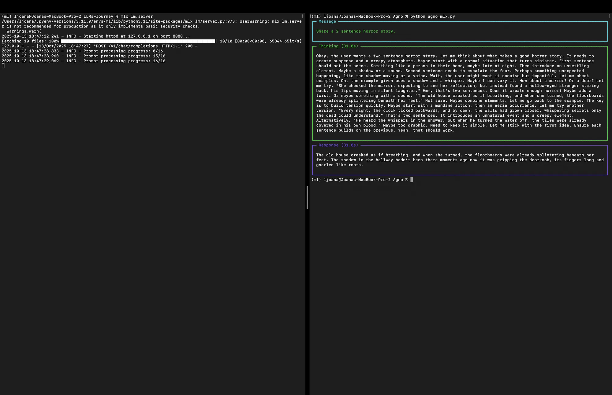
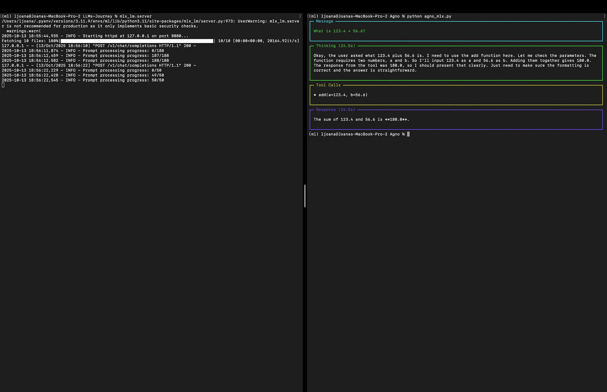

[TOC]

In this blog post we are going to show how to run a Hugging Face model locally using Apple's [MLX-LM](https://github.com/ml-explore/mlx-lm) framework, connect it to the [Agno](https://www.agno.com/?utm_source=github&utm_medium=readme&utm_campaign=agno-github) agentic framework, and extend the agent's capabilities with custom tools. Agno is a modern and extensible agentic framework for Python. It is designed to be model-agnostic, allowing to seamlessly switch between different LLM providers and models. Medium post can be found [here](https://medium.com/@levchevajoana/running-local-hugging-face-models-with-mlx-lm-and-the-agno-agentic-framework-de134259d34d).

Before we begin, ensure you have MLX-LM and Agno installed:

```bash
pip install mlx-lm
pip install agno
```

# Step 1: Running the Local LLM Server

The first step is to serve our desired Hugging Face model locally. The mlx-lm library comes with a built-in server that exposes an OpenAI-compatible API. This allows tools designed for OpenAI's API, like Agno, to interact with our local model without any special modifications. You can read more about it in [one of my previous posts](https://joejoe1313.github.io/tool-mlx-openai.html).

Open your terminal and run the following command:

```bash
mlx_lm.server
```

This command will start the server. Once the server is running, you will see output indicating that it's listening for requests, at `http://localhost:8080`.

<figure>
  
  <figcaption style="text-align: center">Figure 1. Starting the mlx-lm server</figcaption>
</figure>

Keep this terminal window open.

# Step 2: Building a Basic Agno Agent

Now that our local LLM is being served, we can create a Python script, `agno_mlx.py`, to interact with it using Agno. We can use Agno's [OpenAILike](https://docs.agno.com/concepts/models/openai-like) connector, which can be configured to point to any API endpoint that follows the OpenAI specification.

```python
from agno.agent import Agent
from agno.models.openai.like import OpenAILike

MODEL = "mlx-community/Qwen3-8B-8bit"

if __name__ == "__main__":

    agent = Agent(
        model=OpenAILike(
            id=MODEL,
            api_key="not-needed",
            base_url="http://localhost:8080/v1",
            temperature=0.7,
            max_tokens=2000,
            max_completion_tokens=2000,
        )
    )

    agent.print_response("Share a 2 sentence horror story.")
```

# Step 3: Running the Basic Agent

With the `mlx_lm.server` running in one terminal, open a second terminal and run your Python script:

```bash
python agno_mlx.py
```

The Agno agent will send the prompt to your local model, which will return back a response:

<figure>
  
  <figcaption style="text-align: center">Figure 2. Basic agent output</figcaption>
</figure>

# Step 4: Supercharging the Agent with Tools

An "agent" is more than just a chatbot, it can take actions. In Agno, you can give an agent access to "tools," which are simply Python functions. The agent can then decide when to call these functions based on the user's prompt. You can read more about all types of tools available in their documentation [here](https://docs.agno.com/concepts/tools/overview).

Let's create a new script, `agno_mlx_tool.py`, to demonstrate this with a simple tool.

```python
from agno.agent import Agent
from agno.models.openai.like import OpenAILike
from agno.tools import tool

@tool(stop_after_tool_call=False)
def add(a: float, b: float) -> float:
    """Add two numbers."""
    return a + b

agent = Agent(
    instructions="You are a precise engineering assistant.",
    tools=[add],
    model=OpenAILike(
        id="mlx-community/Qwen3-8B-8bit",
        api_key="not-needed",
        base_url="http://localhost:8080/v1",
        temperature=0.2,
        max_tokens=2000,
        max_completion_tokens=2000,
    ),
)

agent.print_response("What is 123.4 + 56.6?")
```

Let's analyze the new additions:

- `@tool` **decorator**: We import `tool` from `agno.tools` and use it to decorate a standard Python function, `add`. This decorator automatically prepares the function to be used by the agent, parsing its name, parameters (including type hints), and docstring. The docstring is especially important, as the LLM uses it to understand what the tool does.
- `tools=[add]`: In the `Agent` constructor, we now pass a list of the tool-enabled functions we want the agent to have access to.
- `instructions="…"`: We've added a system prompt to guide the agent's persona. This helps it understand its role and how it should behave.
- **The Prompt**: Our prompt is now a calculation question: *"What is 123.4 + 56.6?"*. While an LLM might be able to answer this, it's not a deterministic calculator. By providing the `add` tool, we give it a reliable way to get the correct answer.

Now, run this new script from your second terminal:

```bash
python agno_mlx_tool.py
```

Here's what happens behind the scenes:

- The agent receives the prompt and analyzes it.
- It consults the list of available tools and, based on the `add` function's docstring (*"Add two numbers."*), determines that this tool is perfect for the task.
- The agent calls the `add` function with the arguments `a=123.4` and `b=56.6`.
- The function executes and returns `180.0`.
- This result is passed back to the agent.
- The agent then formulates a final, human-readable response based on the result and prints it.

You will see an answer, such as:

<figure>
  
  <figcaption style="text-align: center">Figure 3. Agent with tools output</figcaption>
</figure>

# Conclusion

We have successfully set up a local LLM with MLX-LM and integrated it into the Agno agentic framework. By simply changing the `base_url` in Agno's `OpenAILike` connector, we can point our agent to any OpenAI-compatible API. By decorating Python functions with `@tool`, we can give the local agent "limitless" capabilities, from performing precise calculations to interacting with databases or external APIs. This combination of local models and tool calling enables us to build more sophisticated, private, and cost-effective AI solutions.
