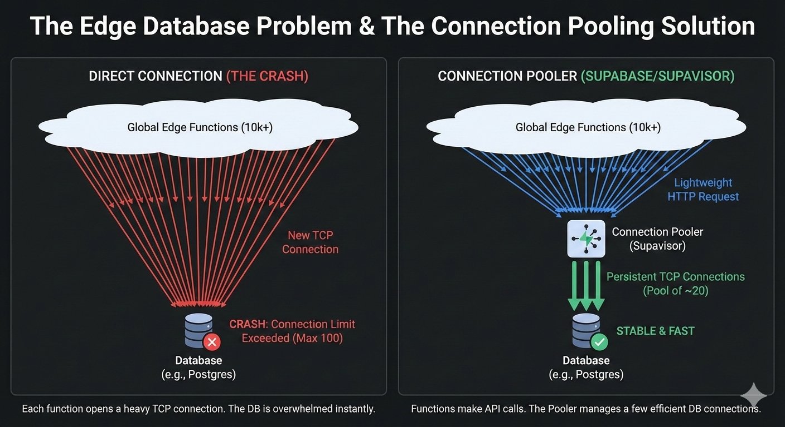

[TOC]

This post covers the technical and theoretical differences between **Edge Functions** and traditional **Serverless Functions** (like AWS Lambda). We are going to explore how they differ in runtime architecture, performance characteristics, and show 2 simple use cases.

# What are Edge Functions?

At its core, an **Edge Function** is a piece of code that executes as close to the user as possible. Unlike traditional cloud functions that run in a specific "Region" (Northern Virginia - `us-east-1`), Edge Functions are **deployed globally** across a **Content Delivery Network (CDN)**. When a user makes a request, the code executes at the **Point of Presence (PoP)** nearest to them.

#### "Isolates" vs. Containers

To understand Edge Functions, we should first understand the runtime technology. Most traditional serverless functions (like AWS Lambda) use **Containers** or **Firecracker MicroVMs**. When a function is triggered, the provider spins up a mini-server (container). This is powerful but heavy. Edge Functions (like Cloudflare Workers or Vercel Edge) typically use **V8 Isolates**.

- **What is an Isolate?** Instead of booting a whole operating system or container, the runtime spins up a secure, isolated context within a single existing process.
- **The Benefit:** This eliminates the overhead of an OS boot. Isolates can spin up in microseconds, effectively eliminating the "Cold Start" problem.

# What are "Traditional" Serverless Functions?

"Serverless" usually refers to Function-as-a-Service (FaaS) offerings like **AWS Lambda**, **Google Cloud Functions**, or **Azure Functions**. These are centralized compute units. The user selects a region, deploys their code, and the cloud provider handles the scaling. They are event-driven and ephemeral but generally run in a heavier environment than edge functions. Some key characteristics are:

- **Region-Specific:** You choose where they live.
- **Full Runtime:** You get a full Node.js, Python, or Go environment.
- **Access to Power:** You have access to the file system (`/tmp`), native binaries, and TCP sockets for long-running database connections.

# Edge vs. Serverless

Here is the comparison across four critical dimensions.

#### Latency & Network Topology

- **Serverless:** If your user is in Paris and your function is in `us-east-1`(Virginia), the request must travel across the Atlantic, process, and return. The speed of light imposes a hard floor on latency (~80-100ms minimum).
- **Edge:** The code runs in a Paris data center. The network travel time is negligible (often <10ms).

#### Cold Starts

- **Serverless:** If your function hasn't run in a while, the provider must "boot" the container.
    - **Impact:** 100ms to 2+ seconds of delay.
- **Edge:** Because they use V8 Isolates (or WebAssembly), there is no OS to boot.
    - **Impact:** Near-zero cold starts (single-digit milliseconds).

#### Runtime Environment & Limitations

This is where the "theoretical" constraints become practical roadblocks.

| Feature | Serverless (Lambda/Node.js) | Edge Functions (V8/Workers) |
|---------|-----|-----|
| Runtime | Full Node.js/Python environment. | Limited Standard Web APIs (Fetch, Request, Response). |
| NPM Support | nearly all packages work. | Many packages fail (especially those relying on Node internal modules like fs, net, or native binaries). |
| Execution Limit | Long (15 mins on Lambda). | Short (Often 10ms–30s depending on provider). |
| Code Size | Large (50MB+ zipped). | Tiny (Often < 1MB-5MB). |

#### Data Connectivity (The "Database Paradox")

This is often the most confusing aspect of Edge computing. If Edge functions are so fast, why are they considered "bad" for database operations?

**The Physics Problem:**
When you connect to a standard database (Postgres/MySQL) via TCP, two things kill performance at the Edge:

- **Connection Exhaustion:** Edge functions scale infinitely. If 10,000 users visit your site, 10,000 functions spin up. They will instantly exhaust the connection limit of a standard database (often limited to ~100 connections).
- **Handshake Latency:** Setting up a secure TCP connection requires a "handshake." If your function is in Tokyo and your DB is in Virginia, the handshake requires multiple round-trips across the ocean *before* the query is even sent.

**The Solution (e.g., Supabase, Neon):**
Modern "Serverless Databases" solve this by abandoning raw TCP connections in favor of HTTP/REST and Connection Pooling.

- **HTTP over TCP:** Instead of a persistent connection, the Edge function makes a lightweight HTTP request (like a REST API call).
- **Connection Pooling:** A middleware (like Supabase's Supavisor, see **Figure 1** below) sits in front of the database. It manages the heavy TCP connections and serves the lightweight Edge requests, preventing the database from crashing.

<figure>
  
  <figcaption style="text-align: center">Figure 1. The edge database problem and Supabase's connection pool solution </figcaption>
</figure> 

# When to use which?

Do not default to Edge just because it is "faster." It is often more restrictive. A useful guide is:

Use Edge Functions When:

- **Request Manipulation:** You need to modify HTTP headers, rewrite URLs, or perform A/B testing redirections before the request hits your server.
- **Personalization:** You are injecting user-specific data (like "Welcome, User from Bulgaria") into a cached page.
- **Authentication:** Validating JWT tokens at the edge to reject unauthorized requests without hitting your main servers.
- **Geolocation:** Serving different content based on the user's country.

Use Serverless Functions When:

- **Heavy Compute:** Image processing, video transcoding, or massive data aggregation.
- **Complex Database Operations:** Transactions involving centralized SQL databases or legacy systems.
- **Long-Running Tasks:** Web scrapers or background jobs that take minutes to complete.
- **Node.js Dependency:** You need specific libraries that rely on native OS binaries

# Example Use Cases

We are going to illustrate two simple use cases: one for when to use an Edge Function, and one for when to use a Serverless Function.

#### Use Case 1: Edge Function (A/B Testing Middleware)

**Why here?** This logic needs to happen *before* the site loads. Waiting for a centralized server in Virginia to decide which version of the site a user in Tokyo sees adds unnecessary latency.

The Code (Conceptual JavaScript/Next.js Middleware):

```javascript
// This runs on the Edge (e.g., Cloudflare Workers or Vercel Edge)
import { next } from '@vercel/edge';

export default function middleware(request) {
  // 1. Get the user's location from the incoming request
  const country = request.geo.country || 'US';

  // 2. Define the buckets
  // 50% chance to see the 'new-feature' bucket
  const bucket = Math.random() < 0.5 ? 'legacy' : 'new-feature';

  // 3. Rewrite the URL based on the bucket
  // The user sees "example.com" but we silently serve "example.com/b"
  const url = request.url;
  
  if (bucket === 'new-feature') {
    url.pathname = `/new-feature${url.pathname}`;
  }

  // 4. Return the response instantly
  // We add a header so the client knows which bucket they are in
  return next(url, {
    headers: {
      'x-ab-bucket': bucket,
      'x-user-location': country
    }
  });
}
```

**Key Takeaway:** This executes in milliseconds. It uses standard Web APIs (`request`, `url`) rather than Node.js specific APIs.

#### Use Case 2: Serverless Function (Image Processing)

**Why here?** Resizing images requires heavy CPU power and native binaries (like `sharp` or `imagemagick`). Edge functions usually have strict size limits (e.g., 1MB script size) and cannot run these heavy binaries.

The Code (Node.js / AWS Lambda style):

```javascript
// This runs in a Container (e.g., AWS Lambda)
const sharp = require('sharp'); // Heavy native library
const AWS = require('aws-sdk');
const s3 = new AWS.S3();

exports.handler = async (event) => {
  const bucket = event.Records[0].s3.bucket.name;
  const key = event.Records[0].s3.object.key;

  // 1. Fetch the raw image from S3 (File System access)
  const inputImage = await s3.getObject({ Bucket: bucket, Key: key }).promise();

  // 2. Perform heavy compute (Resize)
  // This might take 500ms - 2s depending on image size
  const resizedImage = await sharp(inputImage.Body)
    .resize(width: 800)
    .toFormat('jpeg')
    .toBuffer();

  // 3. Save the result back to storage
  await s3.putObject({
    Bucket: bucket,
    Key: `resized-${key}`,
    Body: resizedImage
  }).promise();

  return { status: 'success', message: 'Image resized' };
};
```

**Key Takeaway:** This script uses `require('sharp')`, a heavy dependency that wouldn't work in a V8 Edge environment. It also performs asynchronous file I/O operations that can take several seconds without timing out.

# Conclusion

Edge Functions eliminate cold-start latency by executing in V8 Isolates deployed globally across CDN points of presence, reducing response time by 10-100ms compared to centralized serverless functions. However, their tight execution constraints—sub-30 second timeouts, sub-5MB code limits, and limited persistent connections—restrict them to stateless, I/O-light operations: request routing, authentication, header manipulation, and geolocation-based content delivery. For latency-sensitive decisions at the network perimeter, Edge Functions provide measurable performance gains; for workloads requiring database access or heavy computation, they are fundamentally unsuitable.
